## Computer vision in a nutshell 

Computer vision, commonly abbreviated as CV, could be described as a field of study that allows a computer to analyze and have understanding of an uploaded digital image or group of images, such as videos. 

The main idea of ​​CV, along with robotics and other fields of study, is to improve tasks that could be exhaustive or repetitive for humans. In recent years, there have been many improvements with the invention of complex computer vision and deep learning systems, such as the well-known convolutional neural networks. These inventions shifted the point of view to solve many problems, such as facial recognition or medical images. 

For this course specifically,we are going to use of python 3.5 and opencv 3.  Although this python version could be considered  outdated, it is a very stable version. However,  feel free to change to newest versions like python 3.7.  Some features may change, but it keeps the main idea.


### Images

First of all, we need to understand what exactly an image is. Colloquially, we could describe it as a visual representation of something that by itself is a set of many characteristics as color, shapes, etc. For a computer, an image could be better described as a matrix, in which every value is considered a pixel, so when you are talking about a 1080p image resolution, you are referring to an specific 1080x1920 px matrix

### Color 
<div style="text-align:center">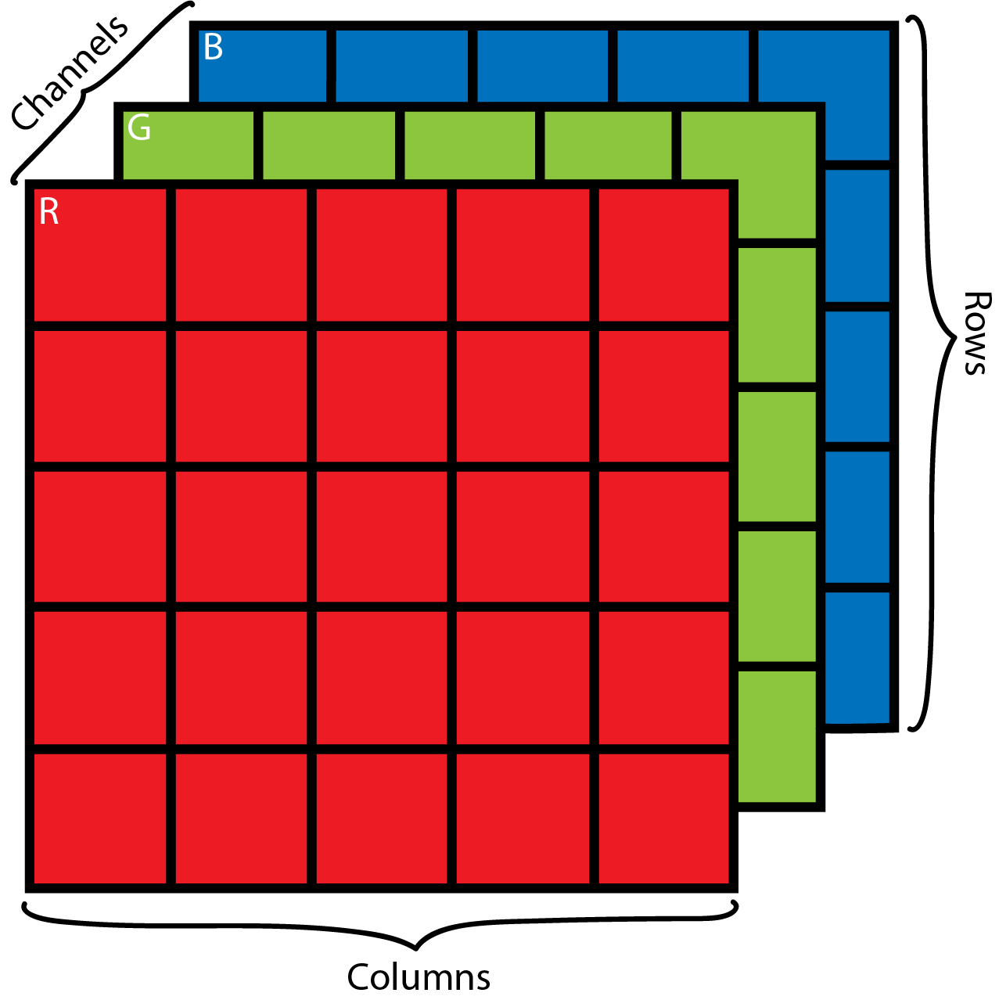</div>

In the case of a colored image, we are talking about a three-dimensional matrix where each dimension corresponds to an specific color channel (Red, green, blue). The dimensions of this matrix will be different for different color spaces, which we will discuss further in the course. 

We can describe an image in many more complex ways, like the color construction that is a result mainly of the light over the object surface. When we have something black, it is actually the lack of light.  The color formation will depend on the wavelength of the main components of white light.

If you like physics as much as I do, you will find interesting a phenomenon where the color deformation can be seen: the stars. In many pictures of space, you can see that the rock formations that are far from us have a red color, while the closest ones have a blue color. This phenomenon was discovered by the North American astronomer Edwin Hubble in 1929. We know that the space is in constant expansion, so if the space is deformed, the light that we receive from those stars will suffer from that expansion too. As a consequence the wavelength of the light will be higher and the color we perceive will have a red tone instead of a blue one.

<div style="text-align:center">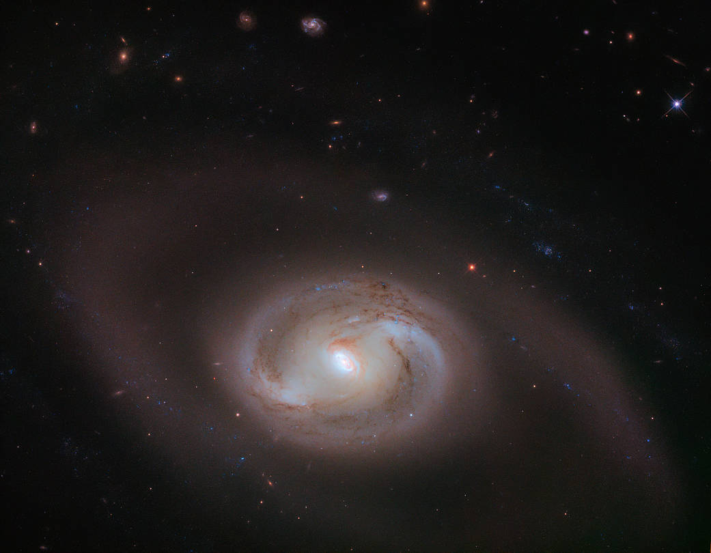</div>
<br>
I don't want to go much deeper on the color formations and theory of it.The main idea is so you can understand the basis of what are we going to work with for the rest of the course. It will be  helpful if you want to do a more profound research on this topic, that I consider really interesting. 

### Going into practice! 

Ok, so now that you have a brief introduction about what computer vision is, and a little background of image formation, it's time to describe one of the basics tasks of CV, **color filtering**. Color filtering is extracting from an image the information of an specific color. Before that, we will see some basic operations with opencv so you can get acquainted with this library, and understand the code ahead.

#### Loading an image 

###### *Basics/load_img.py*

```python 
#Import the Opencv Library
import cv2

#Read the image file
img = cv2.imread('test_image_1.jpg')

#Display the image in a window
cv2.imshow('image',img)

#The window will close after a key press
cv2.waitKey(0)
cv2.destroyAllWindows()
```

#### Loading a video

###### *Basics/load_vid.py*

```python  
import cv2

#Read the video
cap = cv2.VideoCapture("Test_video.mp4")

#Runs until the last frame of the video has been analyzed
while(True):

    #Read every frame of the video
    ret, frame = cap.read()
    
    #Display each frames 
    cv2.imshow('frame',frame)

    #The loop will break if the key is pressed
    if cv2.waitKey(1) & 0xFF == ord('q'):
        break

#The video window will close
cap.release()
cv2.destroyAllWindows()
```

Before going into color filtering, you need to understand the concept of space colors. We are going to use it often during the course. Additionally, it will help you to experiment with different color spaces for different applications. A space color is no more than a three-dimensional model that tries to describe the human perception known as color, where the coordinates of the model will define an specific color. One of them that you may know is the RGB, where all the colors are created by mixing red, green and blue (Python works with a quite different model of RGB, inverting the order of the colors, so the final model is BGR).

<div style="text-align:center">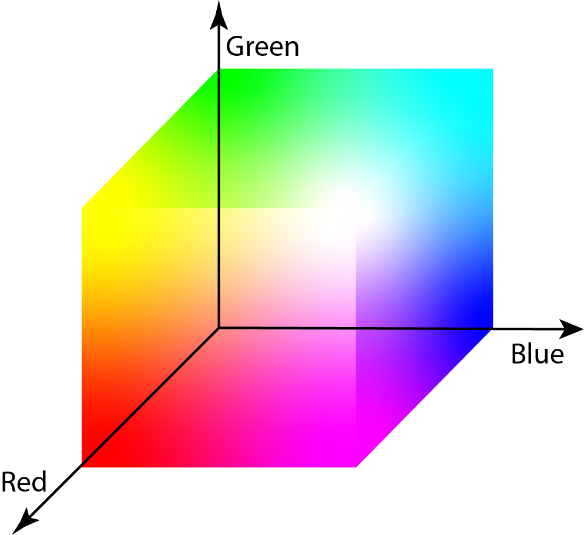</div>
<br>

Just like we said at the beginning of the course, one of the main objectives is to detect colors in images. For this specific task, we will use a color space know as HSV (Hue Saturation Value) that is a closer model of how humans perceive colors, this a non linear model of RGB with cylindrical coordinates.

<div style="text-align:center">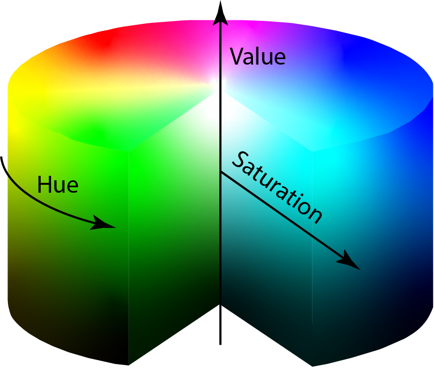</div>
<br>

For the next exercise, we will apply a color filter to the next image. The main idea of this exercise is to pull apart each of the three colors.

<div style="text-align:center"></div>
<br>

We use the HSV space colors, because it makes easier to define the color we want, the color components itself are defined by the Hue channel, being all the chromatic spectrum present in it, compared to the RGB that we need all the three channels to define a color.

###### *Color Filtering/main.py*
```Python
import cv2

#Import the numpy library which will help with some matrix operations
import numpy as np 

image = cv2.imread('Filtering.png')

#I resized the image so it can be easier to work with
image = cv2.resize(image,(300,300))

#Once we read the image we need to change the color space to HSV
hsv = cv2.cvtColor(image, cv2.COLOR_BGR2HSV)

#Hsv limits are defined
#here is where you define the range of the color you´re looking for
#each value of the vector corresponds to the H,S & V values respectively
min_green = np.array([50,220,220])
max_green = np.array([60,255,255])

min_red = np.array([170,220,220])
max_red = np.array([180,255,255])

min_blue = np.array([110,220,220])
max_blue = np.array([120,255,255])
```
For better comprehension of this part, we can make use of the following image, it is an aproximation of how the colors are defined in the hue channel. 

<div style="text-align:center"></div>

For example if the color I'm looking for is blue, my Hue range should be between 110 and 120, or 100 and 130 for a wider range. So the value of my lower limit should look something like ```min_blue = np.array([110,Smin,Vmin])``` and the higher limit ```max_blue = np.array([120,Smax,Vmax])```, in the case of Saturation and value we can say that the lower the saturation the closer to white, and the lower the value the closer to black, as can be seen in the image below:

<div style="text-align:center">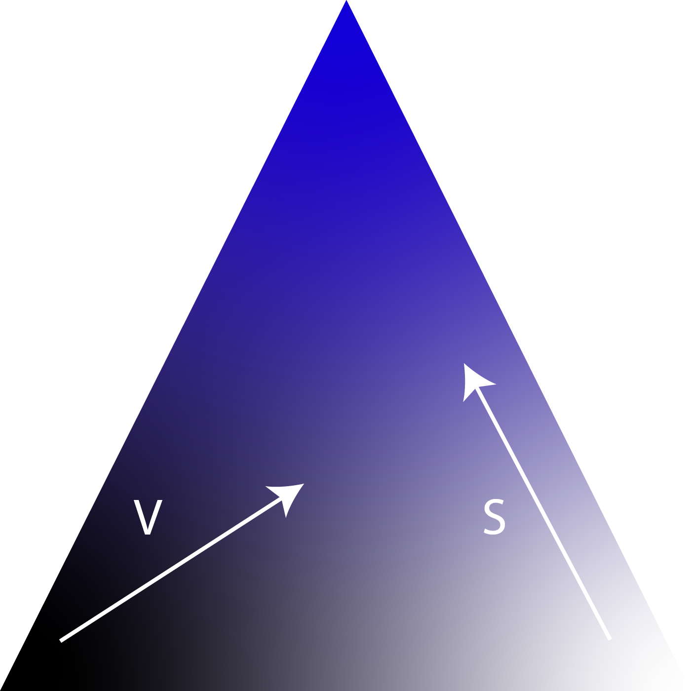</div>

```Python
#This is the actual color detection 
#Here we will create a mask that contains only the colors defined in your limits
#This mask is binary
mask_g = cv2.inRange(hsv, min_green, max_green)
mask_r = cv2.inRange(hsv, min_red, max_red)
mask_b = cv2.inRange(hsv, min_blue, max_blue)

#We use the mask with the original image to get the colored post-processed image
#This is not more than a "AND" operation with the mask, so everything that 
#has a 0 value on the mask, will be 0 in the result as well.
res_b = cv2.bitwise_and(image, image, mask= mask_b)
res_g = cv2.bitwise_and(image,image, mask= mask_g)
res_r = cv2.bitwise_and(image,image, mask= mask_r)

cv2.imshow('Green',res_g)
```
<div style="text-align:center">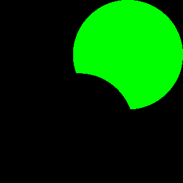</div>
<br>

```Python
cv2.imshow('Red',res_r)
```

<div style="text-align:center"></div>
<br>

```Python
cv2.imshow('Blue',res_b)
```

<div style="text-align:center">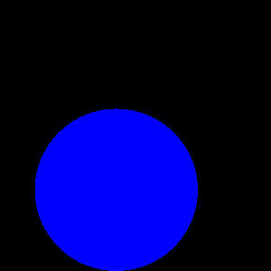</div>
<br>

```Python
cv2.waitKey(0)
cv2.destroyAllWindows()
```

### Edge Detection 

The edge detection in the image processing world is very important because it facilitates the object recognition, region segmentation of images, and many other tasks. The edges are places of the image where an abrupt change in the levels of gray exists.

For this next chapter, we are going to work with edge detection. In first place we will talk about the canny detector, which uses convolution masks and is based on the first derivative, In second place is the sobel operator,  which also works with convolutions. (It should be noted that the canny detector uses the sobel operator to get the first derivative in the horizontal and vertical direction for the gradient).

#### Sobel Operator

The <a href="https://www.researchgate.net/publication/239398674_An_Isotropic_3x3_Image_Gradient_Operator">Sobel operator</a> is used in image processing,especially in edge detection algorithms. The operator calculates the intensity <a href="http://www.cs.umd.edu/~djacobs/CMSC426/ImageGradients.pdf">gradient</a> of an image in every píxel using the convolution function, and the result shows the intensity magnitude changes that could be considered edges. (The convolution is a mathematical operation that can be widely used in the signal processing as a filter - it transforms a two functions into a third one representing how much it changes the second function with respect to the first one).

##### The convolution 

Lets suppose we have a Matrix M with **_m_** rows by **_n_** coolumns: 

<div style="text-align:center">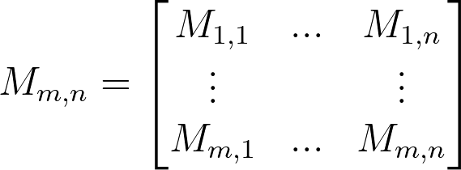</div>
<br>

And a second matrix (this should be a square Matrix), that we will call  the kernel, with **_i_** rows and **_j_** columns: 

<div style="text-align:center">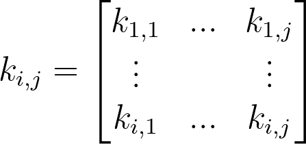</div>
<br>

So the convolution between the **_M_** matrix and the kernel **_k_** will be: 
<div style="text-align:center">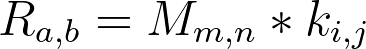</div>
<br>

Which results into a third matrix **_R_**:
 
<div style="text-align:center">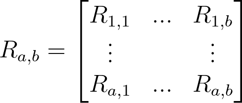</div>
<br>

Where the rows and columns will be defined by: 

<div style="text-align:center">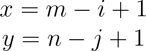</div>
<br>

So the components of R will be given by: 

<div style="text-align:center">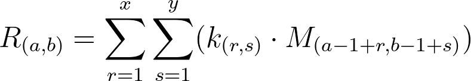</div>
<br>

For better understanding of this operation lets work with a **_5x5_** Matrrix and a **_3x3_** kernel:

<div style="text-align:center">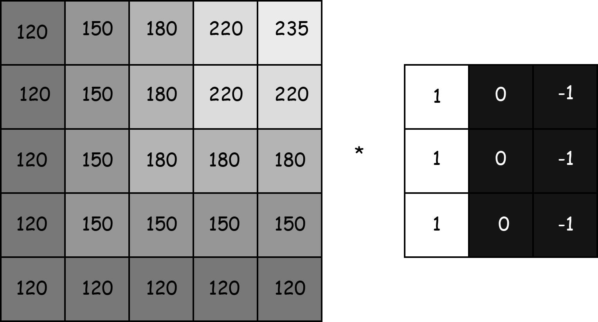</div><br>

The Convolution operation will be something like: 

<div style="text-align:center"></div><br>

As can be seen in the gif above the kernel travels around the image from left to right and top to bottom. The jump distance of the kenel is called stride, that is commonly set as 1px. 

Is important you to understand the convolution operation, the gradient calculated by the sobel operator in a image, is made by convolving the "Sobel Filters" all over the image. We have 2 kernels, for vertical and horizontal gradients: 

<div style="text-align:center">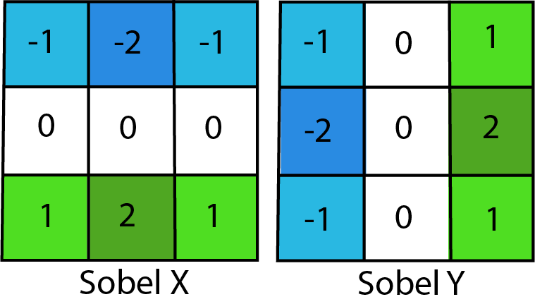</div>

###### *Edge detection/sobelA.py*
```Python
import cv2
import numpy as np

img = cv2.imread('test_img_b.jpg')

#Convert the image to gray scale so the gradient is better visible
img = cv2.cvtColor(img, cv2.COLOR_BGR2GRAY)
img = cv2.resize(img,(450,350))

#Apply the horizontal sobel operator with a kernel size of 3
sobelx = cv2.Sobel(img,cv2.CV_64F,1,0,ksize=3)

#Apply the vertical sobel operator with a kernel size of 3
sobely = cv2.Sobel(img,cv2.CV_64F,0,1,ksize=3)

cv2.imshow('Original',img)
```

<div style="text-align:center"></div>
<br>

```Python
cv2.imshow('sobelx',sobelx)
```

<div style="text-align:center">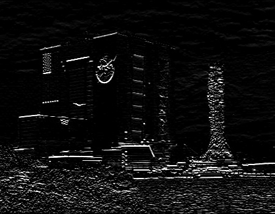</div>
<br>

```Python
cv2.imshow('sobely',sobely)
```

<div style="text-align:center">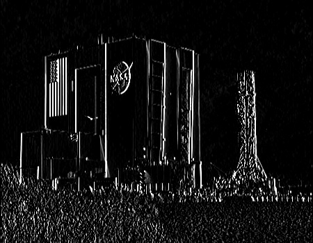</div>
<br>

```Python
cv2.waitKey(0)
cv2.destroyAllWindows()
```

The code above uses an already builded opencv function, however we can replicate this manually using the function ```cv2.filter2D``` to convolve between our image and the Sobel kernels:

###### *Edge Detection/sobelB.py* 
```Python
import cv2
import numpy as np

img = cv2.imread('test_img_b.jpg')

img = cv2.cvtColor(img, cv2.COLOR_BGR2GRAY)
img = cv2.resize(img,(450,350))

#Here we define the sobel operators
#This are no more than a numpy matrix
kernel_x = np.array([[-1,-2,-1],[0,0,0],[1,2,1]])
kernel_y = np.array([[-1,0,1],[-2,-0,2],[-1,0,1]])

#This part is where the magic happens
#We convolve the image read with the kernels defined
x_conv = cv2.filter2D(img,-1,kernel_x)
y_conv = cv2.filter2D(img,-1,kernel_y)

cv2.imshow('Original',img)
```

<div style="text-align:center"></div>
<br>

```Python
cv2.imshow('sobelx',x_conv)
```

<div style="text-align:center"></div>
<br>

```Python
cv2.imshow('sobely',y_conv)
```

<div style="text-align:center"></div>
<br>

```Python
cv2.waitKey(0)
cv2.destroyAllWindows()
```
As you can see, the results are basically the same. The convolution is a method of filtering images that has been used in the last few years for developing complex models of neural networks to work with images and video. This runs out of the idea that instead of a kernel of  you can have many  dimensional kernels of  size, and its values are not fixed, they're variables that can be trained for any purpose. Under this idea you could train a filtering model that can detect almost anything you want. Pretty awesome, right? 

Feel free to play and experiment with the upper code. It is a good exercise to understand what happens when  changing the values of the kernels.Try to add more dimensions to the matrix as well and see what happens.

#### Canny edge detection
*For better understanding of the canny edge detector you can visit the <a href="https://docs.opencv.org/trunk/da/d22/tutorial_py_canny.html">Opencv Page</a>*

This is a multi-stage algorithm based on the sobel operator, described above. The first stage of the canny detector is the Noise reduction, which is done applying a Gaussian Filter, defined by: 

<div style="text-align:center">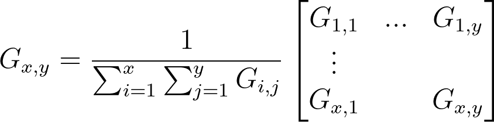</div>

where each value of the kernel is described by: 

<div style="text-align:center">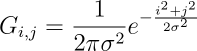</div>

This step will smooth the image, like the algorithm is based on the derivative to get the gradient (Sobel), this is very sensitive to noise, so this step helps to decrease that sensibility. 

The second stage is acquiring the gradients, where the intensity (Magnitud) and orientation of the edges is calculated, the first part is done obtaining the derivatives **_Ix_** and **_Iy_** which can be implemented by convolving the image with the horizontal and vertical Sobel kernels. 

Once we have both derivatives, the magnitud **_G_** and orientation **_θ_** are defined by: 

<div style="text-align:center">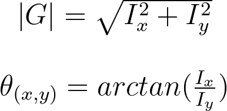</div>

After obtaining this information an stage of <a href="https://arxiv.org/pdf/1705.02950.pdf">Non Maximal supression</a> is applied, to eliminate pixels that could not be wanted. For this, every pixel is checked if it is a local maximum in its neighborhood in the direction of gradient. Finally is applied a stage of Hysteresis thresholding which decides which edges are really edges and which are not.

*A nice explanation of the Hysteresis can be found <a href="https://towardsdatascience.com/canny-edge-detection-step-by-step-in-python-computer-vision-b49c3a2d8123">here</a>.*

###### *Edge detection/canny.py*
```Python
import cv2
import numpy as np 

img = cv2.imread('test_img.png')
img = cv2.resize(img,(450,350))

#The canny detector uses two parameters appart from the image:
#The minimum and maximum intensity gradient
minV = 30
maxV = 100

edges = cv2.Canny(img,minV,maxV)
cv2.imshow('Original',img)
```

<div style="text-align:center"></div>
<br>

```Python
cv2.imshow('Edges',edges)
```

<div style="text-align:center">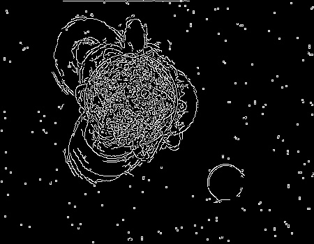</div>
<br>

```Python
cv2.waitKey(0)
cv2.destroyAllWindows()
```

The ```minV``` and ```maxV``` are considered the limits of intensity gradient. This means that if the gradient intesity is lower than ```minV```,  this part of the image are considered non-edges so they will be discarded. If the value is higher than ```maxV```, the they are considered borders. Finally,  those who are in between the limits will be considered edges or non-edges depending on their connectivity. 

### Morphological Transformations 

Morphological transformations are in my personal opinion one of the most important operations in image processing, because they can be helpful with noise suppression in images and other tasks. These are simple operations based on the image form commonly applicated over a binary image. This works with a matrix kernel that can be, for example, a  matrix of ones. 4 of the most common morphological transformations are:

- Erosion
- Dilation
- Opening 
- Closing 
  
*More information about morphological transformations can be found in the <a href="https://docs.opencv.org/trunk/d9/d61/tutorial_py_morphological_ops.html">Opencv Page</a>.*

###### *Transformations/main.py* 

```Python
import cv2
import numpy as np

#Read the image in grayscale 
img = cv2.imread('world.png',0)
img = cv2.resize(img,(450,450))

#Define a kernel for the erosion 
kernel_a = np.ones((5,5),np.uint8)
erosion = cv2.erode(img,kernel_a,iterations = 1)

#Define a kernel for the dilation
kernel_b = np.ones((3,3),np.uint8)
dilation = cv2.dilate(img,kernel_b,iterations = 1)

#Define a kernel for the opening
kernel_c = np.ones((7,7),np.uint8)
opening = cv2.morphologyEx(img, cv2.MORPH_OPEN, kernel_c)

#Define a kernel for the closing
kernel_d = np.ones((7,7),np.uint8)
closing = cv2.morphologyEx(img, cv2.MORPH_CLOSE, kernel_d)

cv2.imshow('Original',img)
```

<div style="text-align:center">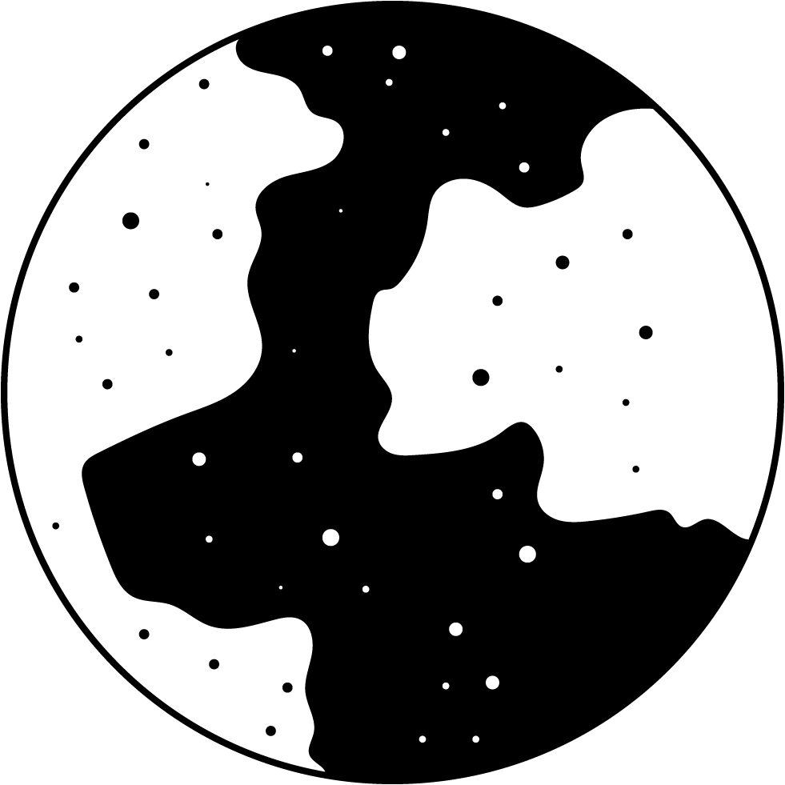</div>
<br>

```Python
cv2.imshow('Erosion',erosion)
```

<div style="text-align:center">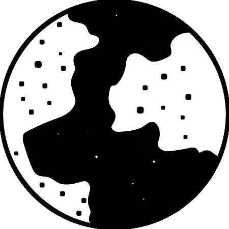</div>
<br>

The erosion transformation provoke the blacks to be wider than the original image.
```Python
cv2.imshow('Dilation',dilation)
```

<div style="text-align:center">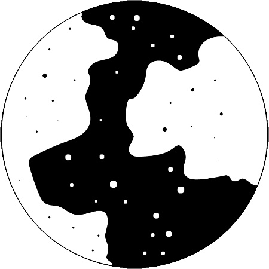</div>
<br>

Unlike the erosion, the dilation provokes the widths to be wider. As you can see, the borders of the circle became thinner.

```Python
cv2.imshow('Opening',opening)
```

<div style="text-align:center">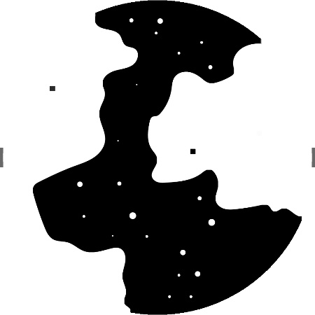</div>
<br>

The opening and the closing are my favourites, because they help to eliminate little dots that can be considered noise in the image. In the case of the opening it sees  the little black dots as noise and suppresses them.

```Python
cv2.imshow('Closing',closing)
```

<div style="text-align:center">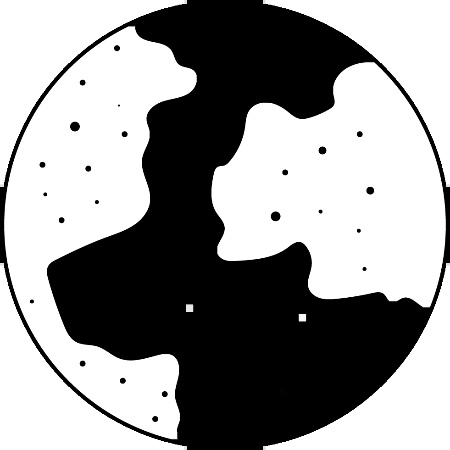</div>
<br>

The closing is similar to the opening, but it works with white noise. As you can see, the inner white dots in the circle were almost totally eliminated from the image.

```Python
cv2.waitKey(0)
cv2.destroyAllWindows()
```

You can modify the parameters of the transformations to make the effect of them stronger or weaker, it will depend on the application you want.