# Object Detection 

In this chapter we will talk about two classic object classifiers: Haar Cascades (We will use them to detect faces on a image) and the Histogram of Oriented Gradients (Which we will use to detect people on images), both of them are based on machine learning Algorithms, the first one using AdaBoost ( Algorithm formulated by Yoav Freund and Robert Schapire), and the second one using Support Vector Machine algorithms(developed by Vladimir Vapnik).

The idea that runs under both algorithm is to extract some important features from the images that can describe something we want, for example a car, the idea will be to extract some characteristics that a computer can interpret as a car, and then use these features to train a machine learning algorithm so it can generalize the abstraction of this desired object.

## Haar Like Features

In the computer vision world one of the most important task is the classification, where you want to detect certain objects on images. For a long time we always wanted a way to detect people, nowadays almost every single camera has a feature that detects people faces and it's pretty accurate. It´s even used in some social apps like snapchat, where an algorithm detects a face and extracts it´s characteristics. 

A pretty good classifier algorithm that opencv has is the *Haar Cascade* which works with Haar Wavelets to analyze image pixels into squares, this was proposed by <a href="https://ieeexplore.ieee.org/abstract/document/990517">Viola & Jones</a> in 2001.This classifier work just like convolutions kernels, where we try to extract different features of the image with *"integral image"*. This uses the AdaBoost learning algorithm selecting small numbers of features from a large set of images.

Detection objects with Haar works just like with any other object detection algorithm. where you have 2 stages, the first one where you extract important features from the images, and then second one where you use an algorithm to classify this information. Haar works with a group of filters, that helps to extrract the main features: 

<div style="text-align:center">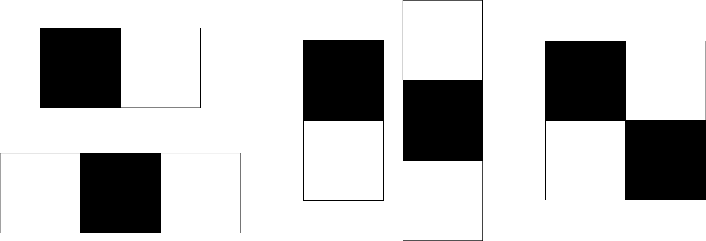</div>

This are similar to the sobel operators, Haar use this filters all over every images to train, and also uses different dimensions, so the algorithm can be scale invariant, this works using different scale filters, for example: 

<div style="text-align:center"></div>

Each of this filters, will travell all around the image: 

<div style="text-align:center"></div>

With this algorithm the number of feature descriptors is very big, this is why, the authors use the integral image before, so it can have better descriptors and a faster processing time. This image is formed so, the intensity of the pixels is accumulated, so the intensity value of a pixel will be given by: 

<div style="text-align:center">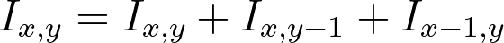</div>

Once we have our Integral Image, we apply all the Haar Filters, and once we obtain the features, we use an <a href="https://codesachin.wordpress.com/tag/adaboost/">AdaBoost</a> algorithm as classifier. 

For this training what we really want is a big data set with positive Images (Images with the object desired) and negative images (Images without the desired object). The main idea is that you can train this models to detect any object you want, similar to convolutional neural networks. In the code ahead you will learn how to use a trained model to detect faces in images. 

###### *FaceDetection/haar.py*

```python 
import numpy as np
import cv2

#First we need to upload the xml classifier 
face_cascade = cv2.CascadeClassifier('frontalface.xml')

img = cv2.imread('face.jpg')
img_2 = cv2.imread('many.jpg')

img = cv2.resize(img,(400,700))

#We need to convert  the image to grayScale
gray = cv2.cvtColor(img, cv2.COLOR_BGR2GRAY)
gray_2 = cv2.cvtColor(img_2, cv2.COLOR_BGR2GRAY)
```
The Scale Factor determines just how much the original image is going to be reduced in every Scale

```python

ScaleFactor = 1.2
```
Just like the name says this wil determine the number of neighbors to a higher value, the model will be more selective 
```python 
minNeighbors = 3
```
We apply the cascades too our grayscaled images
```python 
faces = face_cascade.detectMultiScale(gray, ScaleFactor, minNeighbors)
faces_2 = face_cascade.detectMultiScale(gray_2, ScaleFactor, minNeighbors)

#Once the algorithm finished we will extract the coordinates of the detections 
for (x,y,w,h) in faces:
    #For every coordinate we will draw a rectangle in the original image
    cv2.rectangle(img,(x,y),(x+w,y+h),(255,255,0),2)

    #This will be a cut of the area of interest
    roi = img[y:y+h, x:x+w]

#same for the second image 
for (x,y,w,h) in faces_2:
    cv2.rectangle(img_2,(x,y),(x+w,y+h),(255,255,0),2)
    roi = img_2[y:y+h, x:x+w]  

cv2.imshow('Face',img)

```

<div style="text-align:center">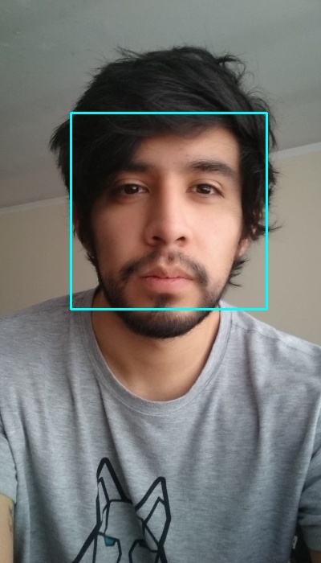</div>
<br>

```Python
cv2.imshow('Faces',img_2)

```

<div style="text-align:center">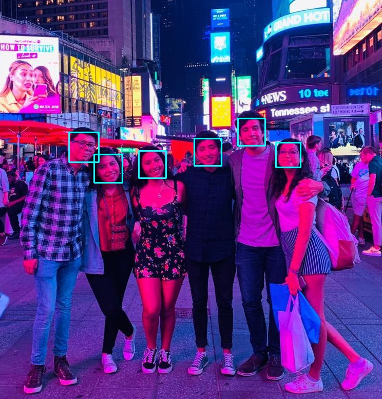</div>
<br>

```Python

cv2.waitKey(0)
cv2.destroyAllWindows()

```
<a href="https://github.com/opencv/opencv/tree/master/data/haarcascades">Opencv</a> offers some pre-trained models, that are pretty fast and accurate, you can download the xml files and try them with some images you want. In personal opinion the face detection with Haar Cascades is really good, of course convolutional neural networks are more accurate but they use a lot of resources to work properly. A good approach if you want to use a face as a biometric patron,  would be to use a lightweight algorithm like Haar Cascades just to get the area of interest and then move this area to a convolutional neural network to get the face classifier. With this instead of analyzing all the image with CNN's you will analize  just a little area where you already known that a face is there.    


## Histogram of Oriented Gradients (HOG)

HOG is one the most famous features descriptor which is based on the gradients orientations of images, do you remeber the chapter one where we talked about sobee kernels to highlight borders, well the main idea of this algorithm is to use this gradients with them orientation to create histrograms boxes of the images, using these histograms as descriptors to train a support vector machine. We will go around this step by step so you can understand the functioning of this algorithm. 
 
### Gradient calculation 

So for this part we will make use of what we have learned in the first chapter, as we already know if we convolve an image with the sobel kernels we will enhance the borders of the images (this is because the edges denote the gradients of the images), in the parts of the image where the color are almost the same the gradient will tend to 0, meanwhile if there is a big change in the gradient the magnitud will be higher. 

Lets suppose the next image:
<div style="text-align:center">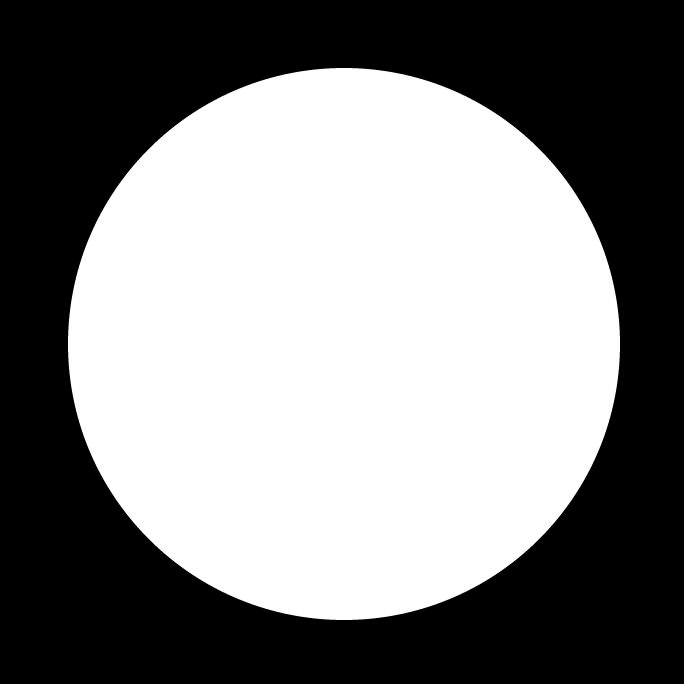</div>

As we can see we have positive an negative gradients going on, there is changes from black to white and white to black.

<div style="text-align:center">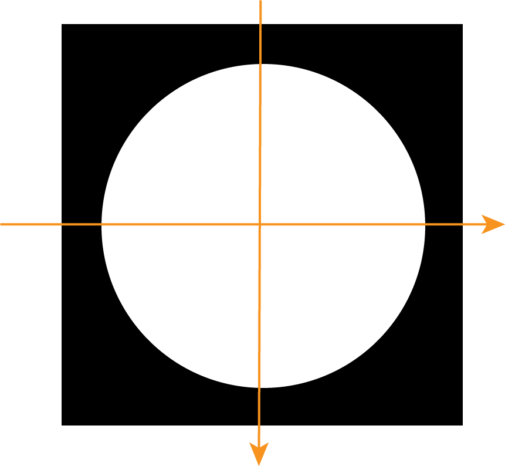</div>

If we apply the sobel kernel convolution to this image we will acquire this gradients for X and Y components.

<div style="text-align:center">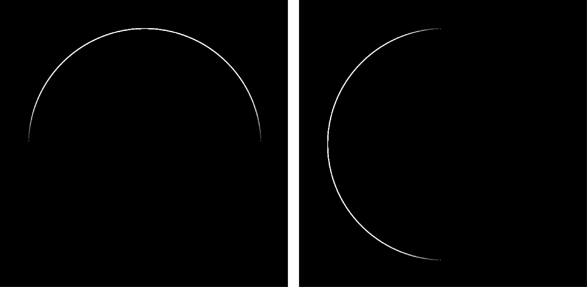</div>                                       

The gradients ar positive only for the changes from dark to light, otherwhise the sign of the gradient is negative. We can calculate this gradient manually, we can extract a block of 3x3 and use simple substraction between points. 

<div style="text-align:center">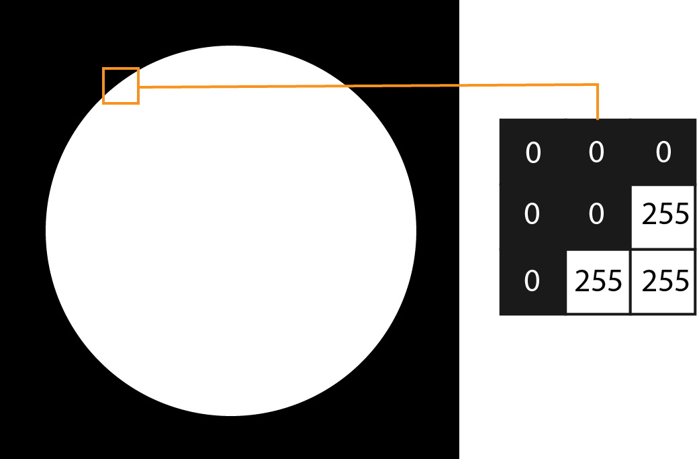</div>      

For the  gradient:


For the  gradient:


Once we have the components of the gradient we can calculate its magnitud and orientation.
<div style="text-align:center">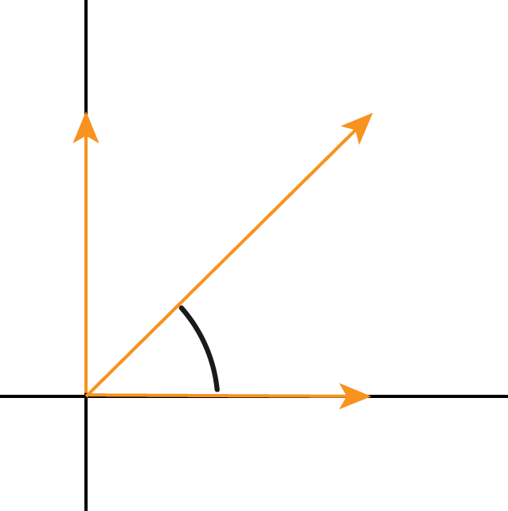</div>

The magnitude of the gradient:


And for the Orientation:

°

### Creating the Histogram

For this part we need to divide our image in blocks of dimension 8x8, it means we will have 64 gradient calculations per area, the main idea is to get this blocks all over the image, we will have an histogram of magnitud and orientation for each of this blocks.

<div style="text-align:center">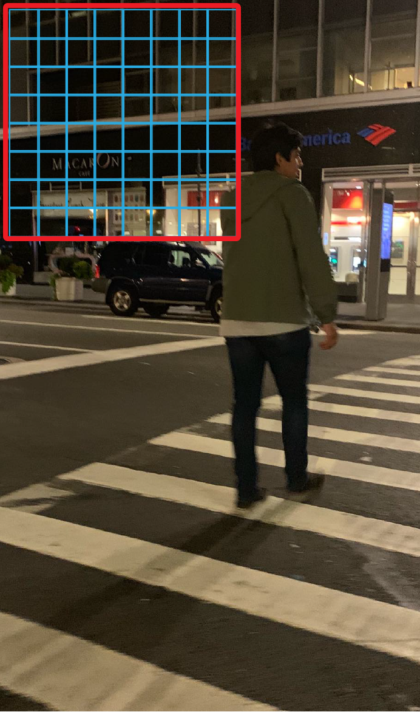</div>

Once we get the blocks of gradients we need to reduce the number of characteristic features (gradient orientation), for this instead of saving all the values from 0° to 180° we will divide it in bins of 20° so we will get information of only 9 orientation values as shown in the following picture: 

<div style="text-align:center">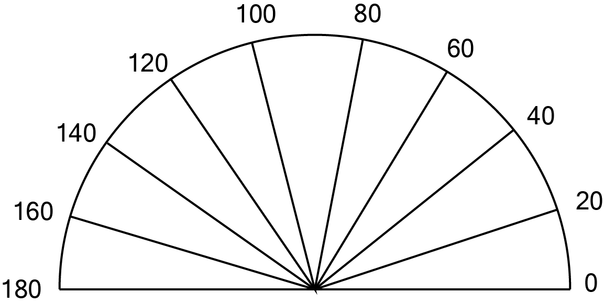</div>

Now that we have a samller segmentation what we need to do is order our 64 vector magnitudes with it respective orientations into a histogram. For the values that are diferrent from the specified we need to ponderate them, for example for  = 45°, the distance to 40 and 60 is 5 and 15 respectively, therefore the ratios will be 5/20 and 15/20, so the magnitud assigned wil be Gm\*1/4 for 40 and Gm\*3/4 for 60.   

<div style="text-align:center">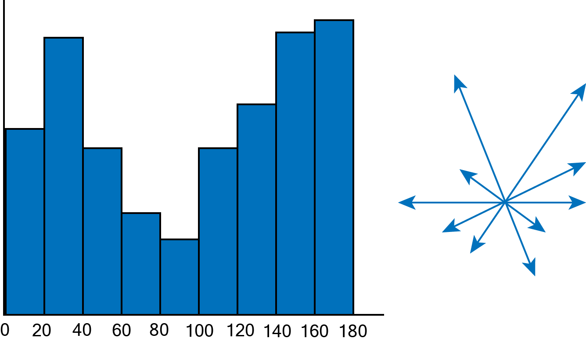</div>

In this way we can calculate the histogram of oriented gradients for every block of the image

<div style="text-align:center">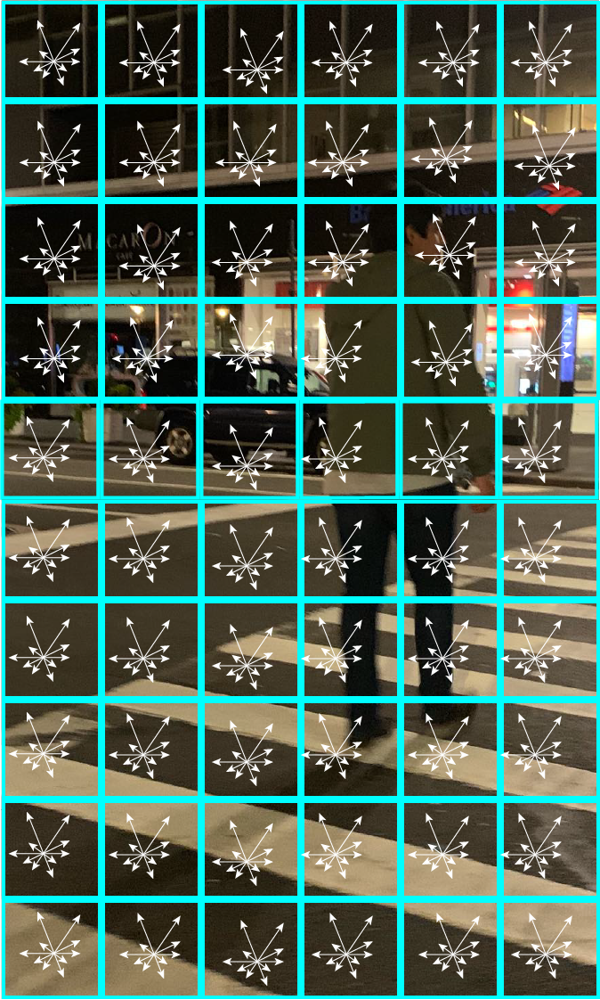</div>

For every block we have a vector of dimension 9, that are the main characteristics that we want to extract from the image, using this descriptors we can train any machine learning algorithm so it can help to detect a desired object in a image. A good way to detect people is using HOG. 

Then we will learn how to apply a people detector using the hog algorithm with an opencv trained model, it is pretty accurate, also we will usea the *Skimage* library so yo can see the computation of the hog descriptors in a image.

<div style="text-align:center"></div>

The first step would be to calculate the sobel components of the image as can be shown in the image above, however, opencv help us with this task, it has an already trained people detector model working under the hog descriptor.
###### *Histogram of Oriented Gradients/Hog.py* 
```Python
import numpy as np
import cv2
 
# Lets initialize the HOG descriptor
hog = cv2.HOGDescriptor()

#We set the hog descriptor as a People detector
hog.setSVMDetector(cv2.HOGDescriptor_getDefaultPeopleDetector())

img = cv2.imread('test_e.jpg')

#The image is pretty big so we will gibve it a resize
imX = 720
imY = 1080
img = cv2.resize(img,(imX,imY))

#We will define de 8x8 blocks in the winStride
boxes, weights = hog.detectMultiScale(img, winStride=(8,8))
boxes = np.array([[x, y, x + w, y + h] for (x, y, w, h) in boxes])

for (xA, yA, xB, yB) in boxes:
    
    #Center in X 
    medX = xB - xA 
    xC = int(xA+(medX/2)) 

    #Center in Y
    medY = yB - yA 
    yC = int(yA+(medY/2)) 

    #Draw a circle in the center of the box 
    cv2.circle(img,(xC,yC), 1, (0,255,255), -1)

    # display the detected boxes in the original picture
    cv2.rectangle(img, (xA, yA), (xB, yB),
                        (255, 255, 0), 2)    

cv2.imshow('frame_2',img)
```
<div style="text-align:center">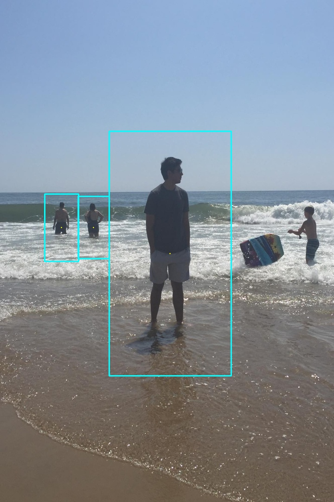</div>

```Python
cv2.waitKey(0)
cv2.destroyAllWindows()
```

As I mentioned before we can use the *Skimage* library to visualize the HOG features. 

###### *Histogram of Oriented Gradients/histogram.py* 
```python
import numpy as np
from skimage import exposure 
from skimage import feature
import cv2
 
img = cv2.imread('test_e.jpg')

imX = 720
imY = 1080
img = cv2.resize(img,(imX,imY))
```

Here we define the main parameters of the model, the number of orientations will be 9 as we explained before. We will have 64 pixels per cell and now we can divide the blocks in cells of 16 * 16, so we define blocks as 2 by 2 each one of 8*8 pixels

```python
(H, hogImage) = feature.hog(img, orientations=9, pixels_per_cell=(8, 8),
	cells_per_block=(2, 2), transform_sqrt=True, block_norm="L1",
	visualize=True)

hogImage = exposure.rescale_intensity(hogImage, out_range=(0, 255))
hogImage = hogImage.astype("uint8")

cv2.imshow('features',hogImage)
```

<div style="text-align:center">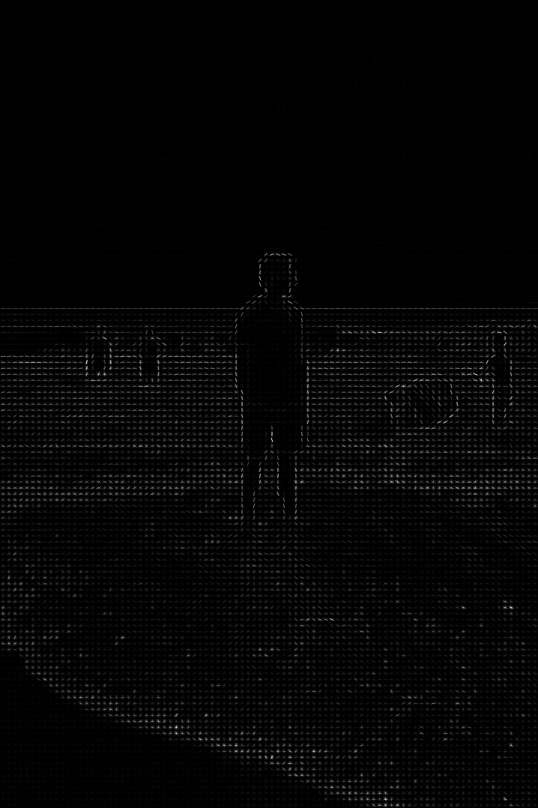</div>

```python
cv2.waitKey(0)
cv2.destroyAllWindows()
```

As you can see the silhouette of the person are very highlighted in the hog descriptor, using this vector values a support vector machine is trained to abstract what a person is, is pretty efficient, and you can use it to detect multiple objects that can rich in hog descriptors. Also a good idea could be to change the learning algorithm to neural networks and compare its performance against the svm. 