# Feature Matching 

Feature matching are a group of algorithms that play an important role in some computer vision applications. The main idea of these is to extract important features from a training image (That contains an specific object) then extract features from other images, where the desired object can be, we will want to compare the features from both images and match them if there is any similitud in between these two images, if there is many matching points, it can happen that the desired object is in the second image as well. 

<div style="text-align:center"></div>
<br>

A feature can be defined as a distinctive attribute or aspect of something, we want these features to be unique for each object, so we can recognize them every time we see them in other images. 

When we are talking about images a features is a piece of relevant information, these can be in specific locations, like some shapes, mountain peaks, corners, etc. These are called keypoints features, these are usually described by a patch of surrounding neighbour pixels. Also we can describe some features through it's edge profile, describing the local appearance and orientation.

Working with Feature matching is pretty straightforward, in general we need to follow some steps:

- Identify Points of Interest.
- Description of the point of interest, desccribing its surrounding, the idea of this step to make de algorithm robust to image transformations, like plane rotation, illumination changes, scale variation, etc. 
- Matching, where you want to compare the features of your object with the ones in other images, seaching for similarities between them.

### Features from Accelerated Segment Test (FAST)

This algorithm was introduced for first time in 2006 by Edward Rosten and Tom Drummond in their work *<a href="http://citeseerx.ist.psu.edu/viewdoc/download?doi=10.1.1.60.3991&rep=rep1&type=pdf">Machine learning for high-speed corner detection</a>*, FAST is an algorithm developed to find corners in images, it works under the idea of the *<a href="http://citeseerx.ist.psu.edu/viewdoc/download?doi=10.1.1.60.3991&rep=rep1&type=pdf">Bresenham Circle</a>*. Basically we want to select a point of the image, form a circle around it, and compare the intensity of the pixels of interest to see if the point selected is or not a corner, taking these corners as feature points. The advantaje of this algorithm is its high speed performance, so it can be easily applied to real time video analysis. 

#### Bresenham circle and corner detection 

Just like I said before we want to select points of the images and compare its intensity with a bresenham circle drawed around the point as can be seen in the image following image. 

<div style="text-align:center"></div>
<br>

Lets suppose the middle point as  **_p_** with an intensity **_Ip_**, so we draw bresenham circle of radious 3, as can we see in the image, we have a total of 16 pixels around the **_p_** point with pretty different intensities. After this, we need to set a threshold value **_t_** which is going to help us to decide whether it is indeed a corner or not.

The first approximation of the algorithm will be comparing the intensity of **_p_** with a set of **_n_** contiguous pixels, so we will consider the point as a corner if all pixels in this group are brighter than **_Ip+t_**, or on the other hand they are all darker than **_Ip-t_**, in the first version of the algorithm the authors used a set of 12 contiguous pixels.

Remember that we have to apply this analysis to every single pixel of the image, so to increase the velocity of this algorithm instead of using a **_n = 12_** its used a **_n = 4_** each pixel corresponding to the cardinal points (taking the pixels 1, 5, 9 & 13 from the image above), in this way we will consider a point as a corner if at least 3 of this pixels are brighter than **_Ip+t_** or darker than **_Ip-t_**.

The problem of this algorithm is that using a **_n < 12_**, in many cases we will have a lot of feature points, and using a higher number of pixels will affect the speed performance of the algorithm. For this reason the authors introduced a machine learning approach to solve the problem, making use of decition trees. 

###### *Fast/fast.py* 
```Python
import cv2
import numpy as np

image = cv2.imread('corner_test_2.png')

gray = cv2.cvtColor(image, cv2.COLOR_RGB2GRAY)

fast = cv2.FastFeatureDetector_create() 

#Keypoints using non Max Supression
Keypoints_1 = fast.detect(gray, None)

#Set non Max Supression disabled 
fast.setNonmaxSuppression(False)

#Keypoints without non max Suppression
Keypoints_2 = fast.detect(gray, None)

#Create two instances of the original image
image_with_nonmax = np.copy(image)
image_without_nonmax = np.copy(image)

# Draw keypoints on top of the input image
cv2.drawKeypoints(image, Keypoints_1, image_with_nonmax, color=(0,35,250))
cv2.drawKeypoints(image, Keypoints_2, image_without_nonmax, color=(0,35,250))

cv2.imshow('Non max supression',image_with_nonmax)
```
<div style="text-align:center">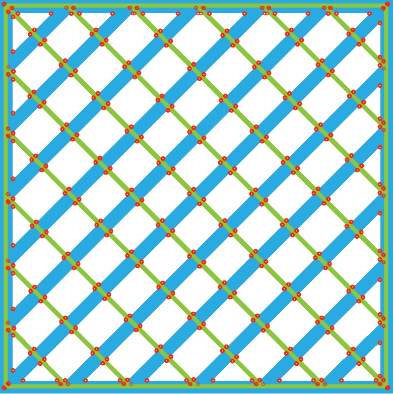</div>

As you can see in the image above, there is many keypoints detected by the FAST algorithm, but many of this points are really close to each others, what means that maybe a corner is being detect more than once, many corners has at least 3 detections because of the nature of the algorithm (Analyzing pixel per pixel).

To solve this problem a Non-maximal Suppression stage is applied, which helps with the detection of multiple interest points in adjacent locations. It basically works calculating a score function **_v_** which is no more than the addition of the absoulute diference between the pixel intensity **_Ip_** and the 16 surrounding pixels. 

We have to calculate this value for each keypoint detected, and then take the adjacent points and discard the ones with the lowest **_v_** value. This algorithm is commonly used in computer vision object detection tasks, where you have multiple detections of the same object.

```Python
cv2.imshow('Without non max Supression',image_without_nonmax)
```
<div style="text-align:center">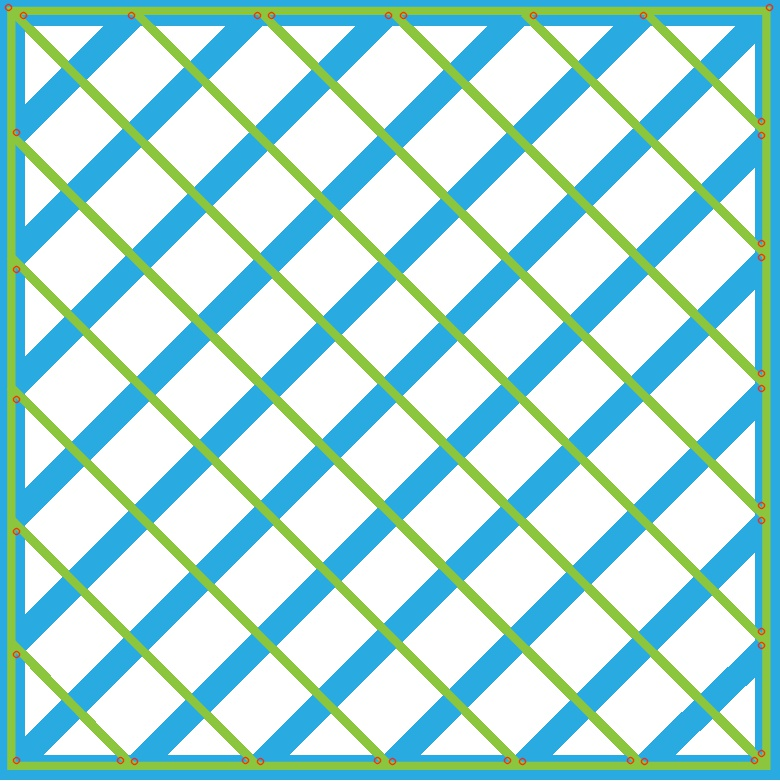</div>

As can we seen, the image above is the result of the FAST algorithm after non-maximal Supression, many points were discarded, also the repetitve points in the middle of the image (like a pattern), only the external points remaining.

```Python
cv2.waitKey(0)
cv2.destroyAllWindows()
```

### Binary Robust Independent Elementary Features (BRIEF)

Ok, so now that we have the keypoints with FAST we need a feature point descriptor such as <a href="https://www.researchgate.net/publication/221304115_BRIEF_Binary_Robust_Independent_Elementary_Features">BRIEF</a> for each of the detected keypoins. The main idea of a descriptor is to convert the given data into a numerical code used to differentiate one point from another, like assigning IDs to every point, using the pixel neighborhood information, so its easier to find the same point in differents images. (Ideally we want this descriptors to be robust, being invariant to image transformations).  

A pixel neighborhood is no more than a square that is around the pixel, and is called a _"patch"_. The BRIEF algorithm converts the patch information into binary vectors, also knonw as _binary feature descriptor_, the authors used a 128–512 bits string vector to describe every feature point detected. 

For this to work properly we need to smooth the kernels cause the algorithm works with every pixel of the image, so we will have tons of information, and smoothing the kernels will help to gather more relevant information, making this the sensitivity can be reduced. The BRIEF algorithm uses Gaussian kernels ranging 0-3 for smoothing the images. _"The more difficult the matching, the more important smoothing becomes to achieving good performance"_. 

Once we smoothed the image we need to create the binary vector descriptor, where we create the binary test "" responses for the patch **_p_** defined by:

<div style="text-align:center">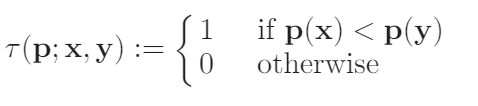</div>

Where **_p(x)_** is the pixel intensity at the point **_x_**, choosing a set of **_n(x,y)_** location pairs uniquely defines a set of binary tests. Now we have to select our random  **_(x,y)_** pairs, for this part the authors experimented with a patch of size **_SxS_** and five sampling geometries, assuming the origin of the patch located in the center of the patch, the pair could be described as:

- **Uniform (I)** where the locations are evenly distributed over the patch and tests can lie close to the patch border.
<div style="text-align:center">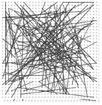</div>
<div style="text-align:center">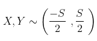</div>

- **Gaussian (II)** x and y follows is drawn by a Gaaussian distribution.  
<div style="text-align:center">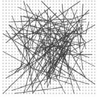</div>
<div style="text-align:center"></div>

- **Gaussian (III)** In this case we will follow two steps, being the first location. **_xi_** sampled from a Gaussian centered around the origin (This Gaussian is the same as the Gaussian above), while the second location is sampled from another Gaussian centered on **_xi_**. With this we are forcing the test to be more local. 
<div style="text-align:center">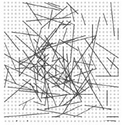</div>
<div style="text-align:center">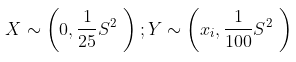</div>

- **Coarse Polar Grid (IV)** The random pair is sampled from discrete locations of a coarse polargrid introducing a spatial quantization. 
<div style="text-align:center">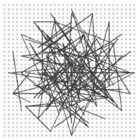</div>

- **Coarse Polar Grid (V)** The fisrt location **_xi_** is (0,0) and the second location **_yi_** takes all possible values on a coarse polar grid.
<div style="text-align:center">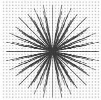</div>
 
From all this samples the authors choosed to use the second model because of its small advantajes, using it for its experiments.  So finally the descriptor will be described as:
<div style="text-align:center">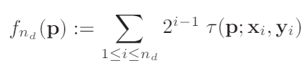</div>

One of the main advantajes of this descriptor is the high speed performance it offers, and also an accurate, despite it is not designed to be rotationally invariant it tollerates small amounts of rotation. 

###### *Brief/brief.py* 
```Python
import cv2
import numpy as np

image = cv2.imread('corner_test_2.png')

gray = cv2.cvtColor(image, cv2.COLOR_RGB2GRAY)

fast = cv2.FastFeatureDetector_create() 
brief = cv2.xfeatures2d.BriefDescriptorExtractor_create()

#Set non Max Supression disabled 
fast.setNonmaxSuppression(False)

```
In 
```Python

keypoints = fast.detect(gray, None)    
brief_keypoints, descriptor = brief.compute(gray, keypoints)

brief = np.copy(image)
non_brief = np.copy(image)

# Draw keypoints on top of the input image
cv2.drawKeypoints(image, brief_keypoints, brief, color=(0,35,250))
cv2.drawKeypoints(image, keypoints, non_brief, color=(0,35,250))

cv2.imshow('Fast corner detection',non_brief)
```
<div style="text-align:center"></div>

```Python

cv2.imshow('BRIEF descriptors',brief)

```
<div style="text-align:center">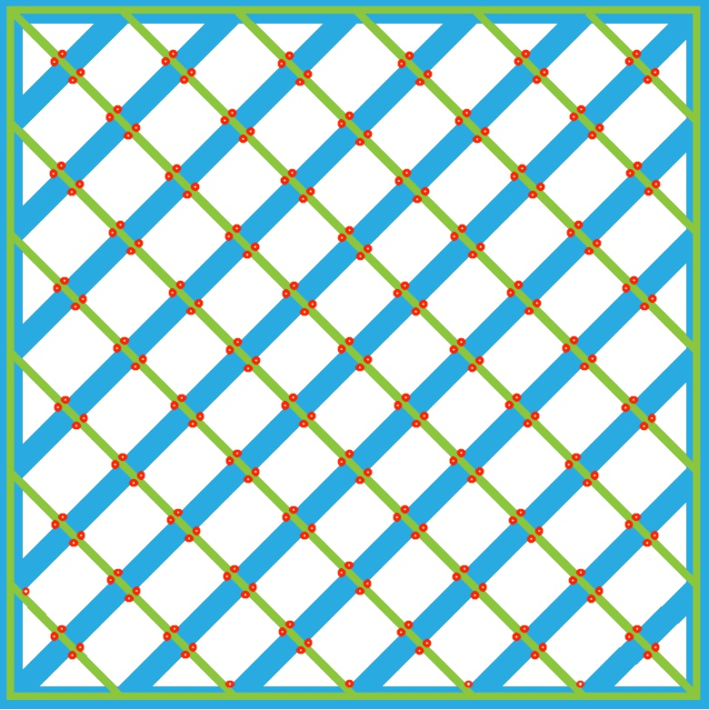</div>

```Python

cv2.waitKey(0)
cv2.destroyAllWindows()
```

### Oriented FAST and Rotated BRIEF (ORB).
###### *Orb/orb.py* 
```Python
import cv2
import matplotlib.pyplot as plt
import numpy as np

image_1 = cv2.imread('test_e.jpg',1)
image_2 = cv2.imread('a.jpg',1) 

gray_1 = cv2.cvtColor(image_1, cv2.COLOR_RGB2GRAY)
gray_2 = cv2.cvtColor(image_2, cv2.COLOR_RGB2GRAY)

#Initialize the ORB Feature detector 
orb = cv2.ORB_create(nfeatures = 1000)

#Make a copy of th eoriginal image to display the keypoints found by ORB
#This is just a representative
preview_1 = np.copy(image_1)
preview_2 = np.copy(image_2)

#Create another copy to display points only
dots = np.copy(image_1)

#Extract the keypoints from both images
train_keypoints, train_descriptor = orb.detectAndCompute(gray_1, None)
test_keypoints, test_descriptor = orb.detectAndCompute(gray_2, None)

#Draw the found Keypoints of the main image
cv2.drawKeypoints(image_1, train_keypoints, preview_1, flags = cv2.DRAW_MATCHES_FLAGS_DRAW_RICH_KEYPOINTS)
cv2.drawKeypoints(image_1, train_keypoints, dots, flags=2)

#############################################
################## MATCHER ##################
#############################################

#Initialize the BruteForce Matcher
bf = cv2.BFMatcher(cv2.NORM_HAMMING, crossCheck = True)

#Match the feature points from both images
matches = bf.match(train_descriptor, test_descriptor)

#The matches with shorter distance are the ones we want.
matches = sorted(matches, key = lambda x : x.distance)
```

For demonstrative reasons we will cut the number matches to 100, so you can se the drawing points better, of course you can use all the matching points (by equaling "good_matches" to "matches[:]"), the more points the better the model, but also it can be more affected by noise.

```Python
#Catch some of the matching points to draw
good_matches = matches[:100]

#Parse the feature points
train_points = np.float32([train_keypoints[m.queryIdx].pt for m in good_matches]).reshape(-1,1,2)
test_points = np.float32([test_keypoints[m.trainIdx].pt for m in good_matches]).reshape(-1,1,2)

#Create a mask to catch the matching points 
#With the homography we are trying to find perspectives between two planes
#Using the Non-deterministic RANSAC method
M, mask = cv2.findHomography(train_points, test_points, cv2.RANSAC,5.0)

#Catch the width and height from the main image
h,w = gray_1.shape[:2]

#Create a floating matrix for the new perspective
pts = np.float32([[0,0],[0,h-1],[w-1,h-1],[w-1,0] ]).reshape(-1,1,2)

#Create the perspective in the result 
dst = cv2.perspectiveTransform(pts,M)

#Draw the matching lines 
dots = cv2.drawMatches(dots,train_keypoints,image_2,test_keypoints,good_matches, None,flags=2)

# Draw the points of the new perspective in the result image (This is considered the bounding box)
result = cv2.polylines(image_2, [np.int32(dst)], True, (50,0,255),3, cv2.LINE_AA)

cv2.imshow('Points',preview_1)
```

<div style="text-align:center"></div>

```Python
cv2.imshow('Matches',dots)
```

<div style="text-align:center">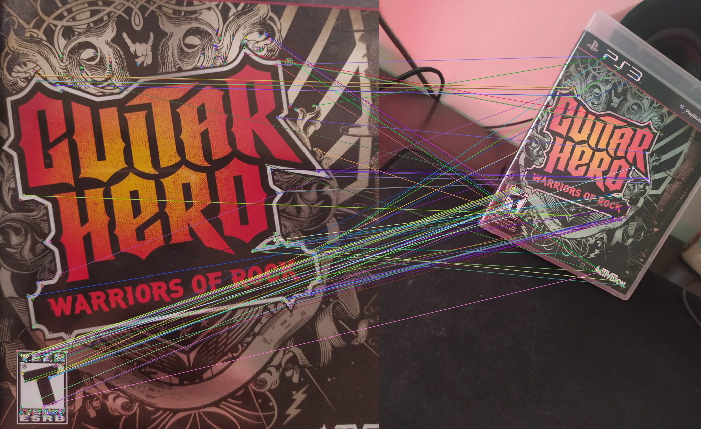</div>

```Python
cv2.imshow('Detection',result)
```

<div style="text-align:center"></div>

```Python

cv2.waitKey(0)
cv2.destroyAllWindows()
```
