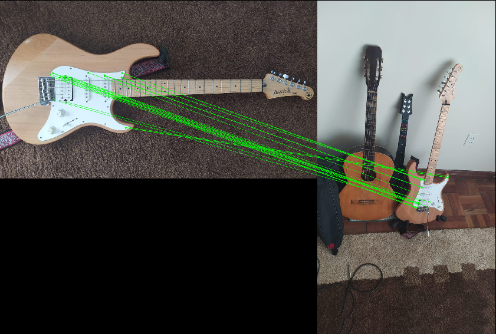
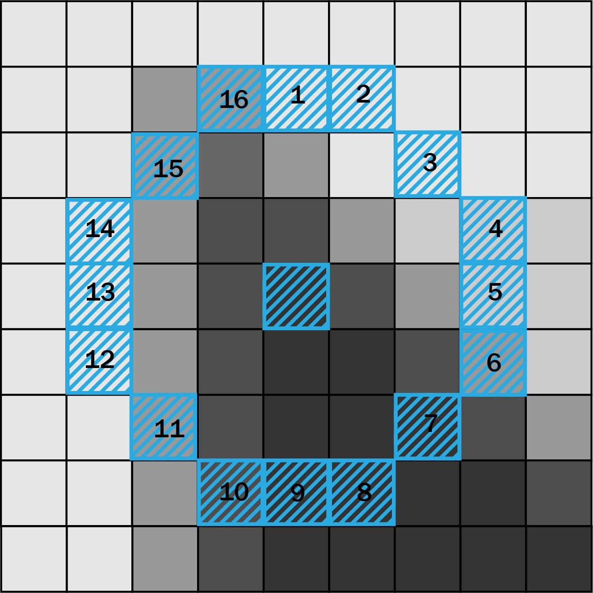

# Feature Matching 

Feature matching are a group of algorithms that play an important role in some computer vision applications. The main idea of these is to extract important features from a training image (That contains an specific object) then extract features from other images, where the desired object can be, we will want to compare the features from both images and match them if there is any similitud in between these two images, if there is many matching points, it can happen that the desired object is in the second image as well. 

 

A feature can be defined as a distinctive attribute or aspect of something, we want these features to be unique for each object, so we can recognize them every time we see them in other images. 

When we are talking about images a features is a piece of relevant information, these can be in specific locations, like some shapes, mountain peaks, corners, etc. These are called keypoints features, these are usually described by a patch of surrounding neighbour pixels. Also we can describe some features through it's edge profile, describing the local appearance and orientation.

Working with Feature matching is pretty straightforward, in general we need to follow some steps:

- Identify Points of Interest.
- Description of the point of interest, desccribing its surrounding, the idea of this step to make de algorithm robust to image transformations, like plane rotation, illumination changes, scale variation, etc. 
- Matching, where you want to compare the features of your object with the ones in other images, seaching for similarities between them.

### Features from Accelerated Segment Test (FAST)

This algorithm was introduced for first time in 2006 by Edward Rosten and Tom Drummond in their work *<a href="http://citeseerx.ist.psu.edu/viewdoc/download?doi=10.1.1.60.3991&rep=rep1&type=pdf">Machine learning for high-speed corner detection</a>*, FAST is an algorithm developed to find corners in images, it works under the idea of the *<a href="http://citeseerx.ist.psu.edu/viewdoc/download?doi=10.1.1.60.3991&rep=rep1&type=pdf">Bresenham Circle</a>*. Basically we want to select a point of the image, form a circle around it, and compare the intensity of the pixels of interest to see if the point selected is or not a corner, taking these corners as feature points. The advantaje of this algorithm is its high speed performance, so it can be easily applied to real time video analysis. 

##### Bresenham circle and corner detection 

Just like I said before we want to select points of the images and compare its intensity with a bresenham circle drawed around the point as can be seen in the image following image. 

 

Lets suppose the middle point as  **_p_** with an intensity **_Ip_**, so we draw bresenham circle of radious 3, as can we see in the image, we have a total of 16 pixels around the **_p_** point with pretty different intensities. After this, we need to set a threshold value **_t_** which is going to help us to decide whether it is indeed a corner or not.

The first approximation of the algorithm will be comparing the intensity of **_p_** with a set of **_n_** contiguous pixels, so we will consider the point as a corner if all pixels in this group are brighter than **_Ip+t_**, or on the other hand they are all darker than **_Ip-t_**, in the first version of the algorithm the authors used a set of 12 contiguous pixels.

Remember that we have to apply this analysis to every single pixel of the image, so to increase the velocity of this algorithm instead of using a **_n = 12_** its used a **_n = 4_** each pixel corresponding to the cardinal points (taking the pixels 1, 5, 9 & 13 from the image above), in this way we will consider a point as a corner if at least 3 of this pixels are brighter than **_Ip+t_** or darker than **_Ip-t_**.

The problem of this algorithm is that using a **_n < 12_**, in many cases we will have a lot of feature points, and using a higher number of pixels will affect the speed performance of the algorithm. For this reason the authors introduced a machine learning approach to solve the problem, making use of decition trees. 