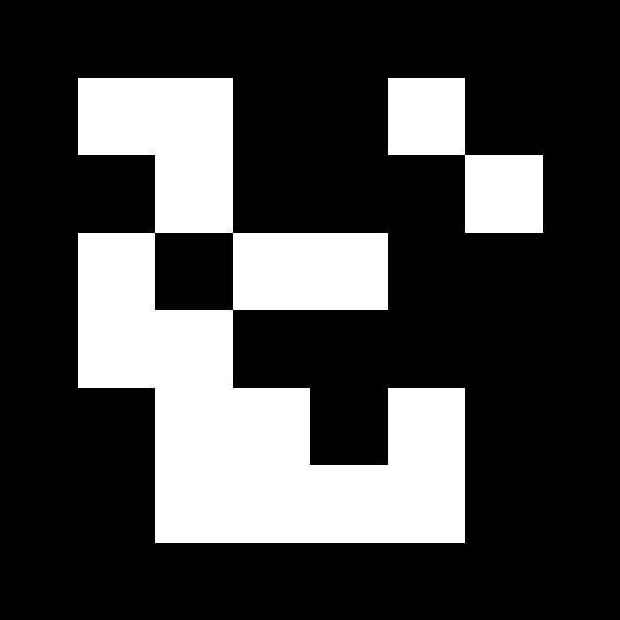
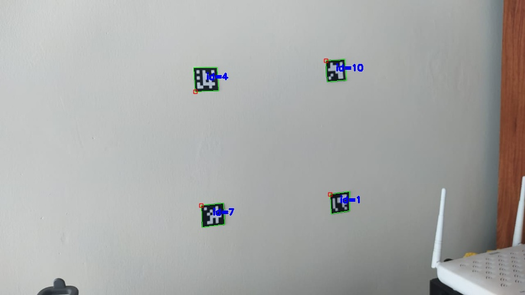
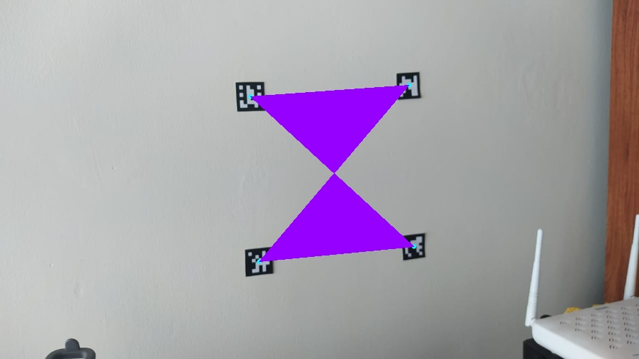
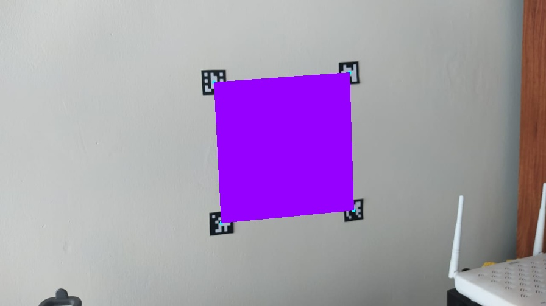
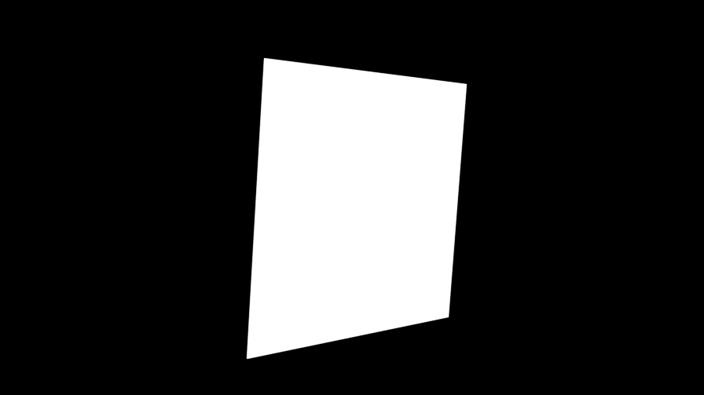
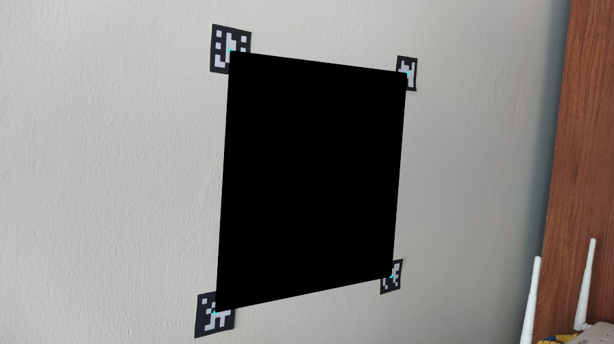
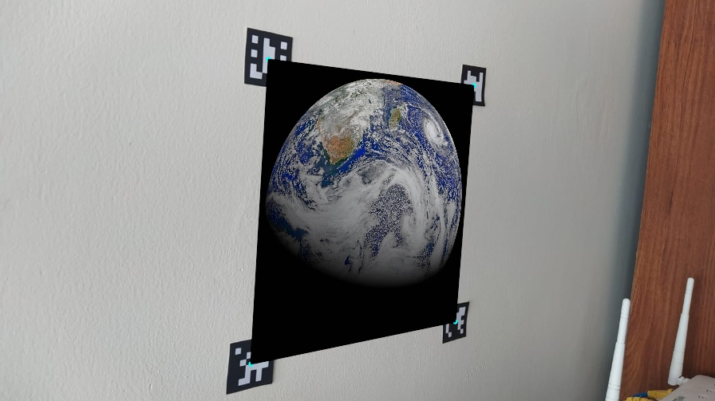

# arTags (Augmented Reality)

So augmented Reality Tags as its name implies, are square fiducial markers desgined to support augmented reality. They can be used to the apparition of virtual objects in real images, also they give us a good aproximation of the position and orientation of objects for robotics for example, it is a big area to explore and play with. For this module we are going to use the ArUco Library with opencv, developed by <a href="https://www.sciencedirect.com/science/article/abs/pii/S0031320314000235">Rafael Muñoz and Sergio Garrido</a>. 

For first we are going to the creation of the tags, *an AruCo marker is a synthetic square marker composed by a wide black border and an inner binary matrix which determines its identifier (id)* -<a href="https://docs.opencv.org/trunk/d5/dae/tutorial_aruco_detection.html">Opencv docs</a>.

<div style="text-align:center"></div>

Opencv has some predefined dictionaries of AR markers that can be used for specific tasks, the consists simply of a list of binary codifications, which main caharacteristics are the size of the marker and the lenght of the dictionary.

For the creation of the Tags we are going to use a dictionary of lenght 250 and markers with size of 6x6 (DICT_6x6_250).

###### arTags/Generate.py

```Python
import os 
import cv2 
import numpy as np 
from cv2 import aruco

#Verify if the folder exists or not 
verify = os.path.isdir('./Tags')

if not(verify):
    #Create a folder to store the generated tags
    os.mkdir("./Tags")

#Initialize the dictionary
aruco_dict = aruco.Dictionary_get(aruco.DICT_6X6_250)
```
The parameters of this function are pretty straightforward, the first one is the dictionary we are going to use, this one was defined at the begining of the code *(DICT_6X6_250)*, the second parameter is the id that will be assigned, in this case we have a for loop so we will create 3 markers with the ids 0,1,2 and 3 respectively, finally the Size makes reference to the size of the output image, in this case will be 700x700 pixels.
```Python
for i in range(1, 4):

    size = 700
    img = aruco.drawMarker(aruco_dict, i, size)
    
    cv2.imwrite('./Tags/image_'+str(i)+".jpg",img)
    
    cv2.imshow('asd',img)
    cv2.waitKey(0)
    cv2.destroyAllWindows
```
Once you created the tags, you can paste them to a document and print them, so you can use them with real images, also you can create more than the 3 markers depending on the application you want. 

For this course we are going to do a little example about augmented reality, replacing an area defined by 4 ArUco tags (being the center of each one the coordinates of a rectangle) with any image, so when the camera detects the markers an image will appear in our camera.

First of all we are going to do an aproximation though Polylines, what I mean with this is that we are going to extract the centers of every marker and join them with lines to form a rectangle and that specific area. 

###### arTags/PPolygon.py 

```Python
import cv2 
import numpy as np 
from cv2 import aruco

def order_coordinates(pts):
    
    #Initialize an empty array to save to next values 
	coordinates = np.zeros((4, 2), dtype="int")

	s = pts.sum(axis=1)
	coordinates[0] = pts[np.argmin(s)]
	coordinates[2] = pts[np.argmax(s)]

	diff = np.diff(pts, axis=1)
	coordinates[1] = pts[np.argmin(diff)]
	coordinates[3] = pts[np.argmax(diff)]

	return coordinates

image = cv2.imread('./Examples/a3.jpg')
h, w = image.shape[:2]

image = cv2.resize(image,(int(w*0.7), int(h*0.7)))
gray = cv2.cvtColor(image, cv2.COLOR_BGR2GRAY)

#Initialize the aruco Dictionary and its parameters 
aruco_dict = aruco.Dictionary_get(aruco.DICT_6X6_250)
parameters =  aruco.DetectorParameters_create()

#Detect the corners and id's in the examples 
corners, ids, rejectedImgPoints = aruco.detectMarkers(gray, aruco_dict, parameters=parameters)

#First we need to detect the markers itself, so we can later work with the coordinates we have for each.
frame_markers = aruco.drawDetectedMarkers(image.copy(), corners, ids)

#Show the markers detected
cv2.imshow('markers',frame_markers)

```
<div style="text-align:center"></div>
As can you see for this example we used random id markers, for the detection we can observe that we have 4 markers with Id´s 1,4,7 and 10, for this specific example the ids doesn´t really matter, cause what we really want is the position of them independently of its ID. Once we got the detection, we will be able to calculate the center of them, with the algorithm we created a corners array where are stored the coordinates of the 16 corners in the image. 

```Python
#Initialize an empty list for the coordinates 
params = []

for i in range(len(ids)):

    #Catch the corners of each tag
    c = corners[i][0]

    #Draw a circle in the center of each detection
    cv2.circle(image,(int(c[:, 0].mean()), int(c[:, 1].mean())), 3, (255,255,0), -1)
    
    #Save thhe center coordinates for each tag
    params.append((int(c[:, 0].mean()), int(c[:, 1].mean())))

#Convert the coordinates list to an array
params = np.array(params)

#Draw a polygon with the coordinates
cv2.drawContours(image,[params],-1 ,(255,0,150),-1)

cv2.imshow('no_conversion',image)
```

<div style="text-align:center"></div>

As can you see in the image, the polygon drawn in the image is very sensitive to the order of the parameters given, in this moment our parameters list is in the order 7 ,1 ,4 ,10  so it will draw this strange figure, so we need to order our the array so the points are correlative like for example 4, 10, 1, 7. 

```Python

if(len(params)>=4):
    #Sort the coordinates
    params = order_coordinates(params)

#Draw the polygon with the sorted coordinates
cv2.drawContours(image,[params],-1 ,(255,0,150),-1)

cv2.imshow('detection',image)
```

<div style="text-align:center"></div>

```Python
cv2.waitKey(0)
cv2.destroyAllWindows()
```
Now that we have an idea of the extraction of the coordinates to draw a rectangle in a specific position, we can use this approximation to replace this purple area with a desired virtual media we want just like a photo of the earth! 

###### arTags/PPolygon.py 

```Python 
import cv2 
import numpy as np 
from cv2 import aruco

def order_coordinates(pts, var):
    coordinates = np.zeros((4,2),dtype="int")

    if(var):
        #Parameters sort model 1 
        s = pts.sum(axis=1)
        coordinates[0] = pts[np.argmin(s)]
        coordinates[3] = pts[np.argmax(s)] 

        diff = np.diff(pts, axis=1)
        coordinates[1] = pts[np.argmin(diff)]
        coordinates[2] = pts[np.argmax(diff)]
    
    else:
        #Parameters sort model 2 
        s = pts.sum(axis=1)
        coordinates[0] = pts[np.argmin(s)]
        coordinates[2] = pts[np.argmax(s)] 

        diff = np.diff(pts, axis=1)
        coordinates[1] = pts[np.argmin(diff)]
        coordinates[3] = pts[np.argmax(diff)]
    
    return coordinates

image = cv2.imread('./Examples/a1.jpg')
h, w = image.shape[:2]

image = cv2.resize(image,(int(w*0.7), int(h*0.7)))
gray = cv2.cvtColor(image, cv2.COLOR_BGR2GRAY)

#Initialize the aruco Dictionary and its parameters 
aruco_dict = aruco.Dictionary_get(aruco.DICT_6X6_250)
parameters =  aruco.DetectorParameters_create()

#Detect the corners and ids in the images 
corners, ids, rejectedImgPoints = aruco.detectMarkers(gray, aruco_dict, parameters=parameters)

#Initialize an empty list for the coordinates 
params = []

for i in range(len(ids)):

    #Catch the corners of each tag
    c = corners[i][0]

    #Draw a circle in the center of each detection
    cv2.circle(image,(int(c[:, 0].mean()), int(c[:, 1].mean())), 3, (255,255,0), -1)
    
    #Save the coordinates of the center of each tag
    params.append((int(c[:, 0].mean()), int(c[:, 1].mean())))

#Transfom the coordinates list to an array
params = np.array(params)
```
In the previous code we sorted the coordinates to an specific order, for this part we need this order and also  a second sort changing the position 2 and 3 of the array, this is done just for the algorithm to work well, when we work with the convexPoly it works with different order than the warped image with the homography. This variation can be seen in the function "order coordinates". 

```Python
if(len(params)>=4):
    #Sort model 1 
    params = order_coordinates(params,False)
    
    #Sort Model 2
    params_2 = order_coordinates(params,True)

#Her we are going to read the image we want to overlap
paint = cv2.imread('./Examples/earth.jpg')
height, width = paint.shape[:2]

#We extract the coordinates of this new image which are basically the full sized image
coordinates = np.array([[0,0],[width,0],[0,height],[width,height]])

#Just like in chapter 3 we will find a perspective between the planes
#Homography will help us with the image transformations
hom, status = cv2.findHomography(coordinates, params_2)
  
#We will save the warped image in a dark space same with the same size as the main image
warped_image = cv2.warpPerspective(paint, hom, (int(w*0.7), int(h*0.7)))

#We create a black mask to do the image operations 
mask = np.zeros([int(h*0.7), int(w*0.7),3], dtype=np.uint8)

#To the black mask we will replace the area described by the ar tags with white 
cv2.fillConvexPoly(mask, np.int32([params]), (255, 255, 255), cv2.LINE_AA)
cv2.imshow('black mask',mask)
```

<div style="text-align:center"></div>

```Python

#We will calculate the difference between the original image and the mask to obtain a black space(No color) in the desired area
substraction = cv2.subtract(image,mask)
cv2.imshow('substraction',substraction)
```

<div style="text-align:center"></div>

```Python

#Once we have the area colored free we can add the warped image through image addition
addition = cv2.add(warped_image,substraction)

cv2.imshow('detection',addition)
```

<div style="text-align:center"></div>

```Python
cv2.waitKey(0)
cv2.destroyAllWindows()
```