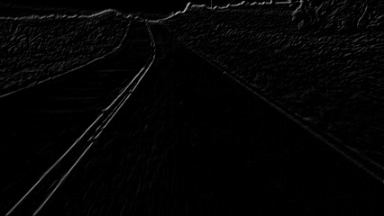

# arTags (Augmented Reality)

So augmented Reality Tags as its name implies, are square fiducial markers desgined to support augmented reality. They can be used to the apparition of virtual objects in real images, also they give us a good aproximation of the position and orientation of objects for robotics for example, it is a big area to explore and play with. For this module we are going to use the ArUco Library with opencv, developed by <a href="https://www.sciencedirect.com/science/article/abs/pii/S0031320314000235">Rafael Muñoz and Sergio Garrido</a>. 

For first we are going to the creation of the tags, *an AruCo marker is a synthetic square marker composed by a wide black border and an inner binary matrix which determines its identifier (id)* -<a href="https://docs.opencv.org/trunk/d5/dae/tutorial_aruco_detection.html">Opencv docs</a>.

<div style="text-align:center"></div>

Opencv has some predefined dictionaries of AR markers that can be used for specific tasks, the consists simply of a list of binary codifications, which main caharacteristics are the size of the marker and the lenght of the dictionary.

A little parenthesis before starting with arTags, is important you have an additional Opencv package "Opencv-contrib", this will allows you to use the library. To install it in your virtual enviroment you can simply run the next command in your shell or command line.

```shell 
pip install opencv-contrib-python
```

For the creation of the Tags we are going to use a dictionary of lenght 250 and markers with size of 6x6 (DICT_6x6_250).

###### arTags/Generate.py

```Python
import os 
import cv2 
import numpy as np 
from cv2 import aruco

#Verify if the folder exists or not 
verify = os.path.isdir('./Tags')

if not(verify):
    #Create a folder to store the generated tags
    os.mkdir("./Tags")

#Initialize the dictionary
aruco_dict = aruco.Dictionary_get(aruco.DICT_6X6_250)
```
The parameters of this function are pretty straightforward, the first one is the dictionary we are going to use, this one was defined at the begining of the code *(DICT_6X6_250)*, the second parameter is the id that will be assigned, in this case we have a for loop so we will create 3 markers with the ids 0,1,2 and 3 respectively, finally the Size makes reference to the size of the output image, in this case will be 700x700 pixels.
```Python
for i in range(1, 4):

    size = 700
    img = aruco.drawMarker(aruco_dict, i, size)
    
    cv2.imwrite('./Tags/image_'+str(i)+".jpg",img)
    
    cv2.imshow('asd',img)
    cv2.waitKey(0)
    cv2.destroyAllWindows
```
Once you created the tags, you can paste them to a document and print them, so you can use them with real images, also you can create more than the 3 markers depending on the application you want. 

For this course we are going to do a little example about augmented reality, replacing an area defined by 4 ArUco tags (being the center of each one the coordinates of a rectangle) with any image, so when the camera detects the markers an image will appear in our camera.

First of all we are going to do an aproximation though Polylines, what I mean with this is that we are going to extract the centers of every marker and join them with lines to form a rectangle and that specific area. 

###### arTags/PPolygon.py 

```Python
import cv2 
import numpy as np 
from cv2 import aruco

def order_coordinates(pts):
    
    #Initialize an empty array to save to next values 
	coordinates = np.zeros((4, 2), dtype="int")

	s = pts.sum(axis=1)
	coordinates[0] = pts[np.argmin(s)]
	coordinates[2] = pts[np.argmax(s)]

	diff = np.diff(pts, axis=1)
	coordinates[1] = pts[np.argmin(diff)]
	coordinates[3] = pts[np.argmax(diff)]

	return coordinates

image = cv2.imread('./Examples/a3.jpg')
h, w = image.shape[:2]

image = cv2.resize(image,(int(w*0.7), int(h*0.7)))
gray = cv2.cvtColor(image, cv2.COLOR_BGR2GRAY)

#Initialize the aruco Dictionary and its parameters 
aruco_dict = aruco.Dictionary_get(aruco.DICT_6X6_250)
parameters =  aruco.DetectorParameters_create()

#Detect the corners and id's in the examples 
corners, ids, rejectedImgPoints = aruco.detectMarkers(gray, aruco_dict, parameters=parameters)

#First we need to detect the markers itself, so we can later work with the coordinates we have for each.
frame_markers = aruco.drawDetectedMarkers(image.copy(), corners, ids)

#Show the markers detected
cv2.imshow('markers',frame_markers)

```
<div style="text-align:center"></div>
As can you see for this example we used random id markers, for the detection we can observe that we have 4 markers with Id´s 1,4,7 and 10, for this specific example the ids doesn´t really matter, cause what we really want is the position of them independently of its ID. Once we got the detection, we will be able to calculate the center of them, with the algorithm we created a corners array where are stored the coordinates of the 16 corners in the image. 

```Python
#Initialize an empty list for the coordinates 
params = []

for i in range(len(ids)):

    #Catch the corners of each tag
    c = corners[i][0]

    #Draw a circle in the center of each detection
    cv2.circle(image,(int(c[:, 0].mean()), int(c[:, 1].mean())), 3, (255,255,0), -1)
    
    #Save thhe center coordinates for each tag
    params.append((int(c[:, 0].mean()), int(c[:, 1].mean())))

#Convert the coordinates list to an array
params = np.array(params)

#Draw a polygon with the coordinates
cv2.drawContours(image,[params],-1 ,(255,0,150),-1)

cv2.imshow('no_conversion',image)
```

<div style="text-align:center"></div>

As can you see in the image, the polygon drawn in the image is very sensitive to the order of the parameters given, in this moment our parameters list is in the order 7 ,1 ,4 ,10  so it will draw this strange figure, so we need to order our the array so the points are correlative like for example 4, 10, 1, 7. 

```Python

if(len(params)>=4):
    #Sort the coordinates
    params = order_coordinates(params)

#Draw the polygon with the sorted coordinates
cv2.drawContours(image,[params],-1 ,(255,0,150),-1)

cv2.imshow('detection',image)
```

<div style="text-align:center"></div>

```Python
cv2.waitKey(0)
cv2.destroyAllWindows()
```
Now that we have an idea of the extraction of the coordinates to draw a rectangle in a specific position, we can use this approximation to replace this purple area with a desired virtual media we want just like a photo of the earth! 

###### arTags/PPolygon.py 

```Python 
import cv2 
import numpy as np 
from cv2 import aruco

def order_coordinates(pts, var):
    coordinates = np.zeros((4,2),dtype="int")

    if(var):
        #Parameters sort model 1 
        s = pts.sum(axis=1)
        coordinates[0] = pts[np.argmin(s)]
        coordinates[3] = pts[np.argmax(s)] 

        diff = np.diff(pts, axis=1)
        coordinates[1] = pts[np.argmin(diff)]
        coordinates[2] = pts[np.argmax(diff)]
    
    else:
        #Parameters sort model 2 
        s = pts.sum(axis=1)
        coordinates[0] = pts[np.argmin(s)]
        coordinates[2] = pts[np.argmax(s)] 

        diff = np.diff(pts, axis=1)
        coordinates[1] = pts[np.argmin(diff)]
        coordinates[3] = pts[np.argmax(diff)]
    
    return coordinates

image = cv2.imread('./Examples/a1.jpg')
h, w = image.shape[:2]

image = cv2.resize(image,(int(w*0.7), int(h*0.7)))
gray = cv2.cvtColor(image, cv2.COLOR_BGR2GRAY)

#Initialize the aruco Dictionary and its parameters 
aruco_dict = aruco.Dictionary_get(aruco.DICT_6X6_250)
parameters =  aruco.DetectorParameters_create()

#Detect the corners and ids in the images 
corners, ids, rejectedImgPoints = aruco.detectMarkers(gray, aruco_dict, parameters=parameters)

#Initialize an empty list for the coordinates 
params = []

for i in range(len(ids)):

    #Catch the corners of each tag
    c = corners[i][0]

    #Draw a circle in the center of each detection
    cv2.circle(image,(int(c[:, 0].mean()), int(c[:, 1].mean())), 3, (255,255,0), -1)
    
    #Save the coordinates of the center of each tag
    params.append((int(c[:, 0].mean()), int(c[:, 1].mean())))

#Transfom the coordinates list to an array
params = np.array(params)
```
In the previous code we sorted the coordinates to an specific order, for this part we need this order and also  a second sort changing the position 2 and 3 of the array, this is done just for the algorithm to work well, when we work with the convexPoly it works with different order than the warped image with the homography. This variation can be seen in the function "order coordinates". 

```Python
if(len(params)>=4):
    #Sort model 1 
    params = order_coordinates(params,False)
    
    #Sort Model 2
    params_2 = order_coordinates(params,True)

#Her we are going to read the image we want to overlap
paint = cv2.imread('./Examples/earth.jpg')
height, width = paint.shape[:2]

#We extract the coordinates of this new image which are basically the full sized image
coordinates = np.array([[0,0],[width,0],[0,height],[width,height]])

#Just like in chapter 3 we will find a perspective between the planes
#Homography will help us with the image transformations
hom, status = cv2.findHomography(coordinates, params_2)
  
#We will save the warped image in a dark space same with the same size as the main image
warped_image = cv2.warpPerspective(paint, hom, (int(w*0.7), int(h*0.7)))

#We create a black mask to do the image operations 
mask = np.zeros([int(h*0.7), int(w*0.7),3], dtype=np.uint8)

#To the black mask we will replace the area described by the ar tags with white 
cv2.fillConvexPoly(mask, np.int32([params]), (255, 255, 255), cv2.LINE_AA)
cv2.imshow('black mask',mask)
```

<div style="text-align:center"></div>

```Python

#We will calculate the difference between the original image and the mask to obtain a black space(No color) in the desired area
substraction = cv2.subtract(image,mask)
cv2.imshow('substraction',substraction)
```

<div style="text-align:center"></div>

```Python

#Once we have the area colored free we can add the warped image through image addition
addition = cv2.add(warped_image,substraction)

cv2.imshow('detection',addition)
```

<div style="text-align:center"></div>

```Python
cv2.waitKey(0)
cv2.destroyAllWindows()
```

### Line Detection with the Hough transform 

The Hough transform is a technique used in the detection of certain shapes in digital images, such as lines or circles that could be mathematically described. It was introduced for first time by Paul Hough in 1962 but in the begining it was used to describe only lines in images, but 10 years later a new technique called <a href="https://dl.acm.org/doi/10.1145/361237.361242">"Generalised Hough Transform"</a> was introduced by Richard Duda and Peter Hart, using the traditional transform to describe different shapes like curves.

The basic idea of the hough trasnform is to change our x,y coordinate axis to the known as Hough Space, for better understanding lets suppose a linear function described by: 


Where: 
-  is the slope of the line function 
-  is the  axis intercept 

This function represents a straight line in the x,y coordinate axis. The Hough space basically consists of replacing the **_x_** axis by the slope and the **_y_** axis by **_b_** in this way a line in the xy space will be represented as a dot in the Hough space: 

<div style="text-align:center"></div>

In the other hand, if we have dots in the normal axis, this will be represented as a line funtion in the Hough space: 

<div style="text-align:center"></div>
 
As  can you see in the image above, both points correspond to a straight line with the same slope and y interception, so if we take this two points to the Hough space they will intercept in a common point, which represents a line in the xy space. This is how we can find continous lines with the hough transform, if we map all the coordinates of an edges image to the hougfh space we proppaly wil find many lines intercepting in different points, if we have for example 200 lines intercepting in the same point, it will propaply represents a line in the normal axis. 

We can also use the parametric or normal notion to represent the line in the space:


where:
-  is the length of a normal from the origin to the line
-  is the orientation of  with respect to the X-axis.

In this way, we can use this two parameters as an alternately axis for the Hough Space: 

<div style="text-align:center"></div>

Using this idea, we can intuit that if the line is under the origin  will have a positive value and ° Otherwise  will have a negative value and  will also be less than °. 

With this idea in mind, the Hough algorithm go as follows, first we will create a matrix (which will represent the Hough space), this is called the accumulator, the rows will be given by  and the columns by , the size of the matrix will depend on the precisition we desire, if we want the precition to be 1° the number of columns will be 180, and the maximum number of rows will be given by the length of the image diagonal, assuming the precisition as 1 pixel. 

After we defined our accumulator we need to iterate all over the image, using all the (x,y) pairs. So for every point found, the algorithm checks which of the lines defined in the accumulator cross through that point, for every time the point belongs to a line (,) the correspondant counter will increase.

After analyzing the whole image, the interest points of the matrix will be the ones with the higher counter, meaning that there is probably the longest continous points, which can be considered as a line.

We can Implement this with <a href="https://docs.opencv.org/3.4/d9/db0/tutorial_hough_lines.html">Opencv</a> as follows: 

###### HoughTransform/hough.py 
```Python
import cv2
import numpy as np

img = cv2.imread('example.png')
gray = cv2.cvtColor(img,cv2.COLOR_BGR2GRAY)

#The first step should be to get an edges image 
edges = cv2.Canny(gray,50,150,apertureSize = 3)

#Here we will define theparameteres for the detector 
#The theta represents the orientation accuracy which is 1°
theta = np.pi/180

#The rho represents the rows accuracy in pixels 
rho = 1

#Finally the threshold is the minimum number that the counter must have in order
#to be considered as a line (in other words could be described as the minimum number of 
#continous points)
threshold = 100

#Run and find the best candidates to be a line 
lines = cv2.HoughLines(edges,rho,theta,threshold)

#The lines vector will have the values of rho and theta 
#which counter is equal or greater than the threshold
images = []
for i in range(len(lines)):
    for rho,theta in lines[i]:

        #Using this information we can reconstruct the lines 
        a = np.cos(theta)
        b = np.sin(theta)
        x0 = a*rho
        y0 = b*rho
        x1 = int(x0 + 1000*(-b))
        y1 = int(y0 + 1000*(a))
        x2 = int(x0 - 1000*(-b))
        y2 = int(y0 - 1000*(a))

        #draw the representing line in the original image
        cv2.line(img,(x1,y1),(x2,y2),(0,0,255),2)
        cv2.imshow('drawn',img)
```        

<div style="text-align:center"></div>

```Python
        if cv2.waitKey(1) & 0xFF == ord('q'):
            break

cv2.waitKey(0)
cv2.destroyAllWindows()
```

It is worth mentioning that the function to get the theta and rho parameters is ```cv2.HoughLines ``` if we want to extract the coordinates **_(x1,y1,x2,y2)_** from the found lines we will use the function ```cv2.HoughLinesP ``` which receives the same parameters as the first one and also 2 additional parameters, the ```minLineLength ``` and the ```maxLineGap```. 

As an example we will implement the hough transform to a lane detector (This is comonly used for self-driving cars)

```Python 
import cv2 
import math
import numpy as np

def sort_param(x1, y1, x2, y2):
    empty_glass = 0

    if (y2 > y1):
        return x1,y1,x2,y2
    else:
        return x2,y2,x1,y1

image = cv2.imread('street_4.jpg')
h,w = image.shape[:2]

#You will want to change the scale depending on your application 
#A lower resolution implies a higher speed, but less information to work with
scale = .5

image = cv2.resize(image,(int(w*scale),int(h*scale)))
gray = cv2.cvtColor(image,cv2.COLOR_BGR2GRAY)

```
###### Image preprocessing 
The first part of the algorithm will be basically the pre-processing, when we gather images, they tend to have a lot of noise, take in count that a road is a relatively uncontrolled environment. So first we want is to condition these images, so the algorithm can have a better performance, in the code ahead we will perform some convolutional operations to extract just some areas of the image that are interesting, using diagonal kernels, after that we will use some image denoising and binarization.

```Python 

#We define 45 degrees filter to catch some specific lines with convolution 
kernel_45 = np.array([[0,1,0],[1,0,-1],[0,-1,0]])
kernel_135 = np.array([[0,1,0],[-1,0,1],[0,-1,0]])

conv_45 = cv2.filter2D(gray,-1,kernel_45)
```

<div style="text-align:center"></div>

```Python
conv_135 = cv2.filter2D(gray,-1,kernel_135)
```

<div style="text-align:center"></div>

```Python
#Add both components
addition = conv_45+conv_135
```

<div style="text-align:center"></div>

```Python
#Use non local means denoising algorithm to reduce the nbackground noise on the image
addition = cv2.fastNlMeansDenoising(addition,addition,h=10,templateWindowSize=3,searchWindowSize=10)
```

<div style="text-align:center"></div>

```Python
#Eliminate intermidiate points with thresholding, so you have only white and black
ret,addition = cv2.threshold(addition,35,255,cv2.THRESH_BINARY)
```

<div style="text-align:center"></div>

```Python
```

If you want to change the scale you should tune up this parameters, in my case I used the scale 0.5 with 350 and 150 and a 0.2 scale with 150 and 100. The calibration of the parameters will highly depend on the perspective of the camera, size of the image, aspect ratio, etc.

```Python 
minLineLength = 350
maxLineGap = 100

theta = np.pi/180
rho = 1
threshold = 80

#Evaluate the image using the Hough transform to catch continous lines
lines = cv2.HoughLinesP(addition,rho,theta,threshold,minLineLength,maxLineGap)

#initialize empty lists to store the coordinates of the desired lines
left_line = []
right_line = []

try:
    for i in range(len(lines)):

        aux_l = 0
        aux_r = 0

        for x1,y1,x2,y2 in lines[i]:

            #First we need to sort our lines
            x1,y1,x2,y2 = sort_param(x1,y1,x2,y2)
            
            #Remove horizontal lines 
            if(abs(y1-y2)<=10):
                continue 

            #Remove 90° vertical lines
            if(abs(x1-x2)<=30):
                continue 
            
            #Calculate width and height
            y_diff = y2 - y1 
            x_diff = abs(x2-x1)

            #Orientation   
            #With this part we will divide between the left and right line
            #And save its values, also we will calculate the slope for each line             
            if(x2<x1):
                if(y_diff>aux_l):
                    aux_l = y_diff
                    left_line = [x1,y1,x2,y2]
                    m_left = (y_diff/x_diff)
                    x_left = x1 
                    y_left = y1
                else:
                    continue

            else: 
                if(y_diff>aux_r):
                    aux_r = y_diff           
                    right_line = [x1,y1,x2,y2]     
                    m_right = (y_diff/x_diff)
                    x_right = x1 
                    y_right = y1
                else: 
                    continue
    
    #This are just the projections of the lines, using basic calculus for a linear function
    #Line projection for the Left side 
    yl_0 = int(h*scale)
    xl_0 = int(((y_left-yl_0)/m_left)+x_left) 

    if(xl_0<=0):
        xl_0 = 0
        yl_0 = int(m_left*(-xl_0+x_left)+y_left)

    yl_1 = yl_0-int(yl_0*0.4)
    xl_1 = int(((y_left-yl_1)/m_left)+x_left)

    #Line projection for the right side
    yr_0 = int(h*scale)
    xr_0 = int(((-y_right+yr_0)/m_right)+x_right) 

    if(xr_0 > int(w*scale)):
        xr_0 = int(w*scale)
        yr_0 = int(m_right*(xr_0-x_right)+y_right)

    yr_1 = yl_0-int(yl_0*0.4)
    xr_1 = int(((-y_right+yr_1)/m_right)+x_right)

    #We draw the projection of the line 
    cv2.line(image,(xl_1, yl_1),(xl_0, yl_0),(255,0,255),8)
    cv2.line(image,(xr_0, yr_0),(xr_1, yr_1),(255,0,255),8)

except: 
    pass

cv2.imshow('result',image)
```

<div style="text-align:center"></div>

```Python
cv2.waitKey(0)
cv2.destroyAllWindows()

```
