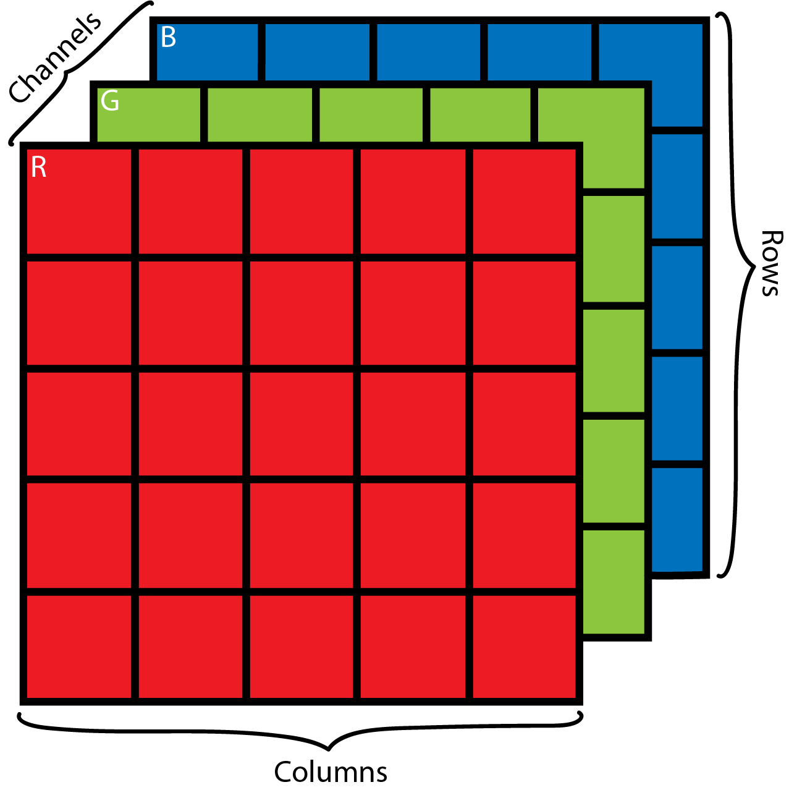
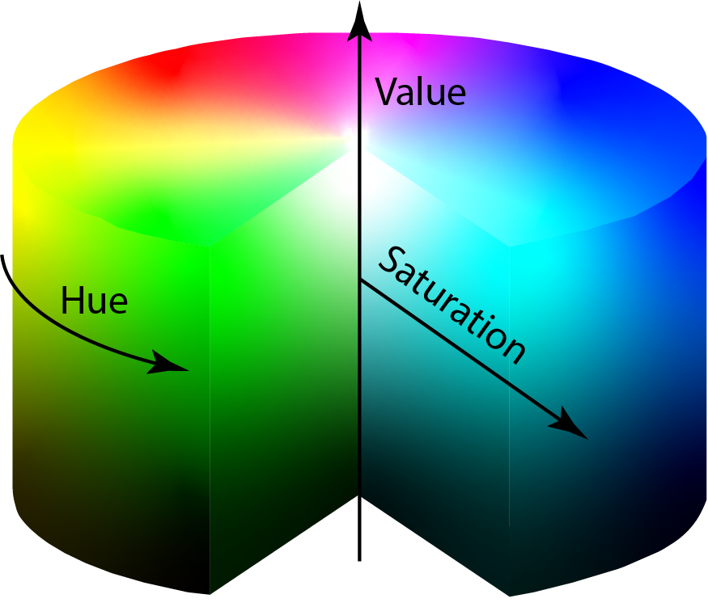
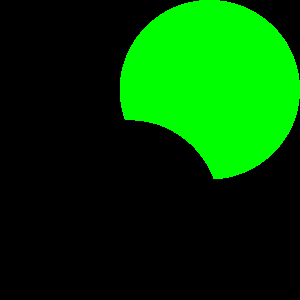
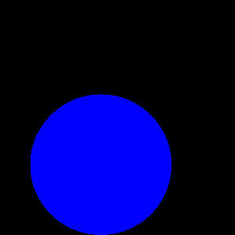
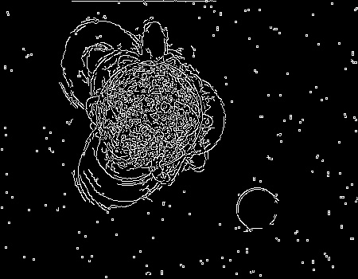
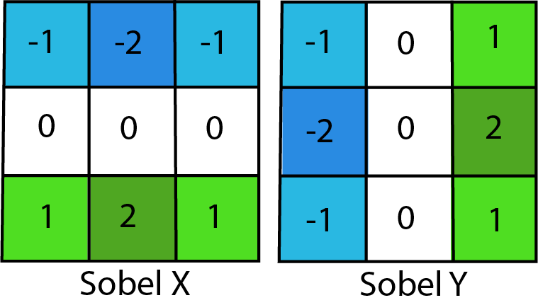

#  Computer Vision Basics

## Introduction 

In this course we will talk about the basics of computer vision, in which we will emphasize the following topics:

- Color spaces and color filtering.
- Edge detection and a brief introduction to convolutions.
- Morphological transformations. 


## Computer vision in a nutshell 

Computer vision commonly abbreviated as CV could be described as a field of study that allows a computer to analyze and have understanding of an uploaded digital image or group of images such as videos. 

The main idea of ​​CV along with robotics and other fields of study is to help and improve tasks that could be exhaustive or repetitive for humans. In recent years, there have been many improvements with the invention of complex computer vision and deep learning systems, such as the well-known convolutional neural networks, which changed the point of view to solve many problems, such as facial recognition or medical images among others. 

For this course in specific we are going to make use of python 3.5 and opencv 3, despite this python version can be considered a little old, is a very stable version, however fell free to change to newest versions like python 3.7, some features may change, but it keeps the main idea. 


### Images

First of all we need to understand what exactly an image, colloquially we could describe it as a visual representation of something that itself is a set of many characteristics as color, shapes, etc. For a computer an image could be better described as a matrix, in which every value is considered a pixel, so when your a talking about a 1080p image resolution, you´re refering to an specific 1080*1920 px matrix.

### Color 
<div style="text-align:center"></div>

In the case of a colored image, we are talking about a three-dimmensional matrix where each dimension corresponds to an specific color chanel (Red, green, blue), the dimensions of this matrix will be different for different color spaces which we will discuss further in the course. 

We can describe an image in many more complex ways, like the color construction that is a result mainly of the light over the object surface, when we have something black it is actually the lack of light, the color formation will depend on the wavelength of the main components of the white light, the infrared and ultraviolet rays. 

If you like physics as much as I you will find an interesting phenomenon where the color deformation can be seen, the stars, in many pictures of the space you can see that the rock formations that are way too far from us has a red color while the closest ones has a blue color, this phenomenom was discovered by the North American Astronomer Edwin Hubble in 1929, we know that the space is in constant expansion, so if the sapce is deformed, the light that we receive from those stars will suffer from that expansion too, in consequence the wavelenght of the light will be higher and the color we perceive will have a red tone instead of a blue one for example. 

<div style="text-align:center"></div>
<br>
I don´t want to go much deeper on the color formations and theory of it, the main idea is so you can know what are we going to work with for the rest of the course, anyway it will be helpfull if you want to do a more profound research on this topics, that I consider are really interesting. 

### Going into practice! 

Ok, so now that you have a brief introduction about what computer vision is, and a little background of image formation, it's time to describe one of the basics tasks of CV, **color filtering**, which means you will want to extract from an image the information of an specific color, but before that we will see some basic operations with opencv so you can get acquainted with this library, and understand the code ahead. 

#### Loading an image 

###### *Basics/load_img.py*

```python 
#Import the Opencv Library
import cv2

#Read the image file
img = cv2.imread('test_image_1.jpg')

#Display the image in a window
cv2.imshow('image',img)

#The window will close after a key press
cv2.waitKey(0)
cv2.destroyAllWindows()
```

#### Loading a video

###### *Basics/load_vid.py*

```python  
import cv2

#Read the video
cap = cv2.VideoCapture("Test_video.mp4")

#Runs until the last frame of the video has been analyzed
while(True):

    #Read every frame of the video
    ret, frame = cap.read()
    
    #Display each frames 
    cv2.imshow('frame',frame)

    #The loop will break if the key is pressed
    if cv2.waitKey(1) & 0xFF == ord('q'):
        break

#The video window will close
cap.release()
cv2.destroyAllWindows()
```

Before going into color filtering you need to understand the concept of space colors, we are going to use it pretty much during the course, also it will help you to experiment with different color spaces for different applications. A space color is no more than a three-dimensional model that tries to describe the human perception known as color, where the coordinates of the model will define an specific color. One of them that you may know is the RGB, where all the colors are created mixing red, green and blue (Python works with a quite different model of RGB, inverting the order of the colors, so the final model is BGR).

<div style="text-align:center"></div>
<br>

Just like we said at the beginning of the course, one of the main objetives is to detect colors in images, for this specific tasks we will use a color space know as HSV (Hue Saturation Value), that is a closer model of how humans percieve colors, this a non linear model of RGB with cilindric coordinates. 

<div style="text-align:center"></div>
<br>

For the next exercise we will apply a color filter to the next image, the main idea is to pull apart each of the three colors.

<div style="text-align:center"></div>
<br>

###### *Color Filtering/main.py*
```Python
import cv2

#Import the numpy library which will help with some matrix operations
import numpy as np 

image = cv2.imread('Filtering.png')

#I resized the image so it can be easier to work with
image = cv2.resize(image,(300,300))

#Once we read the image we need to change the color space to HSV
hsv = cv2.cvtColor(image, cv2.COLOR_BGR2HSV)

#Hsv limits are defined
#here is where you define the range of the color you´re looking for
#each value of the vector corresponds to the H,S & V values respectively
min_green = np.array([50,220,220])
max_green = np.array([60,255,255])

min_red = np.array([170,220,220])
max_red = np.array([180,255,255])

min_blue = np.array([110,220,220])
max_blue = np.array([120,255,255])


#This is the actual color detection 
#Here we will create a mask that contains only the colors defined in your limits
#This mask has only one dimention, so its black and white }
mask_g = cv2.inRange(hsv, min_green, max_green)
mask_r = cv2.inRange(hsv, min_red, max_red)
mask_b = cv2.inRange(hsv, min_blue, max_blue)

#We use the mask with the original image to get the colored post-processed image
res_b = cv2.bitwise_and(image, image, mask= mask_b)
res_g = cv2.bitwise_and(image,image, mask= mask_g)
res_r = cv2.bitwise_and(image,image, mask= mask_r)

cv2.imshow('Green',res_g)
```
<div style="text-align:center"></div>
<br>

```Python
cv2.imshow('Red',res_r)
```

<div style="text-align:center"></div>
<br>

```Python
cv2.imshow('Blue',res_b)
```

<div style="text-align:center"></div>
<br>

```Python
cv2.waitKey(0)
cv2.destroyAllWindows()
```

#### Edge Detection 

The edge detection in image proccesing world is very important, it facilitates the object recognition, region segmentation of images, among others. The edges are places of the image where an abrupt change in the levels of gray exists.

For this next chapter we are going to work with edge detection, two of the most common algorithms are the canny detector which uses convolution masks and is based on the first derivative. In the second part we will work with is the sobel operator same that work with convolutions (It should be noted that the canny detector uses the sobel operator to get the first derivative in the horizontal and vertical direction for the gradient). 

##### Canny edge detection
*For better understanding of the canny edge detector you can visit the <a href="https://docs.opencv.org/trunk/da/d22/tutorial_py_canny.html">Opencv Page</a>*

###### *Edge detection/canny.py*
```Python
import cv2
import numpy as np 

img = cv2.imread('test_img.png')
img = cv2.resize(img,(450,350))

#The canny detector uses two parameters appart from the image:
#The minimum and maximum intensity gradient
minV = 30
maxV = 100

edges = cv2.Canny(img,minV,maxV)
cv2.imshow('Original',img)
```

<div style="text-align:center"></div>
<br>

```Python
cv2.imshow('Edges',edges)
```

<div style="text-align:center"></div>
<br>

```Python
cv2.waitKey(0)
cv2.destroyAllWindows()
```

The ```minV``` and ```maxV``` are considered the limits of intensty gradient, it means that if the gradient intesity is lower than ```minV``` are considered non-edges so they will be discarded, if the value is higher than ```maxV``` are considered borders, and finally those who are in between the limits will be considered edges or non-edges deppending on their connectivity.

##### Sobel Operator

The sobel operator is used in the image processing specialy in edge detection algorithms, the operator calculates the intensity gradient of an image in every píxel using the convolution function, the results shows the intensity magnitud changes that copuld be considered as edges (the convolution is a mathematical operation that can be widely used in the signal processing as a filter, it transforms a two functions into a third one representing somehow how much does it change the second function with respect to the first one).

###### *Edge detection/sobelA.py*
```Python
import cv2
import numpy as np

img = cv2.imread('test_img_b.jpg')

#Convert the image to gray scale so the gradient is better visible
img = cv2.cvtColor(img, cv2.COLOR_BGR2GRAY)
img = cv2.resize(img,(450,350))

#Apply the horizontal sobel operator with a kernel size of 3
sobelx = cv2.Sobel(img,cv2.CV_64F,1,0,ksize=3)

#Apply the vertical sobel operator with a kernel size of 3
sobely = cv2.Sobel(img,cv2.CV_64F,0,1,ksize=3)

cv2.imshow('Original',img)
```

<div style="text-align:center"></div>
<br>

```Python
cv2.imshow('sobelx',sobelx)
```

<div style="text-align:center"></div>
<br>

```Python
cv2.imshow('sobely',sobely)
```

<div style="text-align:center"></div>
<br>

```Python
cv2.waitKey(0)
cv2.destroyAllWindows()
```

This is the method that is already built in Opencv, for better understanding of the sobel operator we can create our own sobel operators and use the convolution to extract the gradients, to find the same results. The Sobel kernels are the following: 

<div style="text-align:center"></div>
<br>

###### *Edge Detection/sobelB.py* 
```Python
import cv2
import numpy as np

img = cv2.imread('test_img_b.jpg')

img = cv2.cvtColor(img, cv2.COLOR_BGR2GRAY)
img = cv2.resize(img,(450,350))

#Here we define the sobel operators
#This are no more than a numpy matrix
kernel_x = np.array([[-1,-2,-1],[0,0,0],[1,2,1]])
kernel_y = np.array([[-1,0,1],[-2,-0,2],[-1,0,1]])

#This part is where the magic happens
#We convolve the image read with the kernels defined
x_conv = cv2.filter2D(img,-1,kernel_x)
y_conv = cv2.filter2D(img,-1,kernel_y)

cv2.imshow('Original',img)
```

<div style="text-align:center"></div>
<br>

```Python
cv2.imshow('sobelx',x_conv)
```

<div style="text-align:center"></div>
<br>

```Python
cv2.imshow('sobely',y_conv)
```

<div style="text-align:center"></div>
<br>

```Python
cv2.waitKey(0)
cv2.destroyAllWindows()
```
As you can see the results are basically the same, the convolution is a method of filtering images that has been used in the last years for developing complex models of neural networks to work with images and video. This runs out of the idea that instead of a kernel of  you can have many  dimensional kernels of  size, and its values are not fixed, they're variables that can be trained for any purpose, under this idea you could be able to train a filtering model that can detect almost anything want, pretty awesome no? 

Feel free to play and experiment with the upper code, a good exercise for the understanding can be changing the values of the kernels, and also adding more dimensions to the matrix to see what happens. 